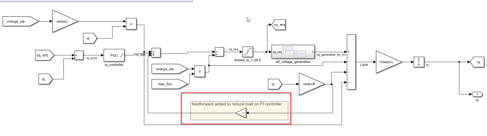
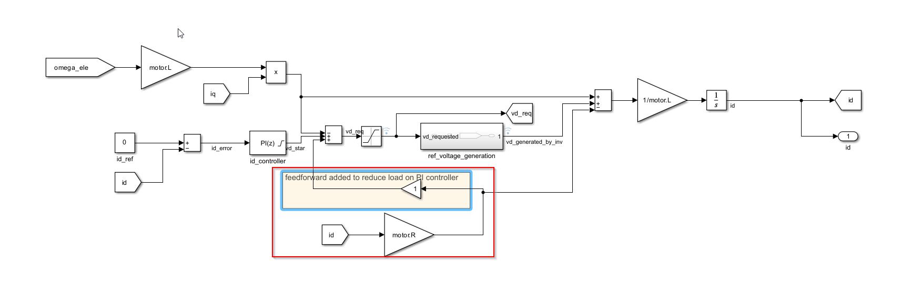
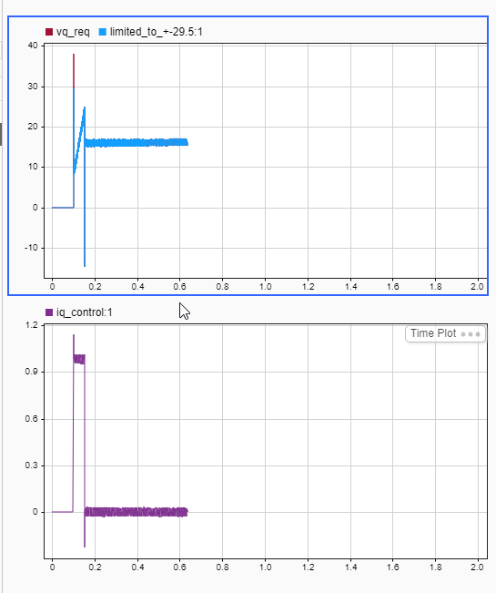
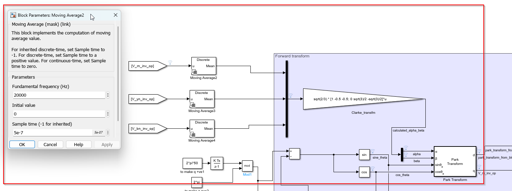
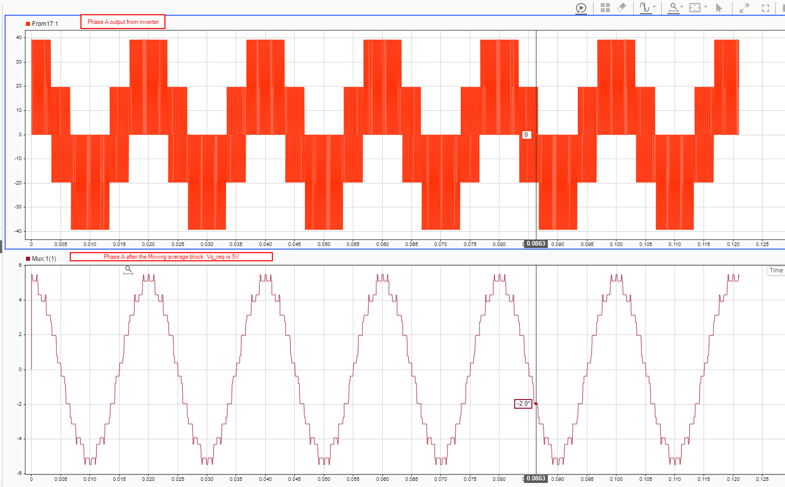
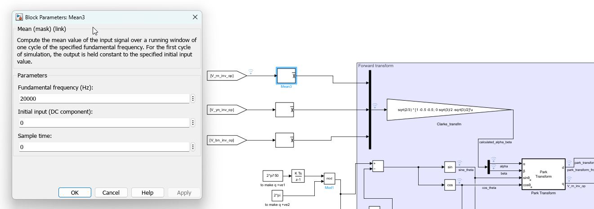
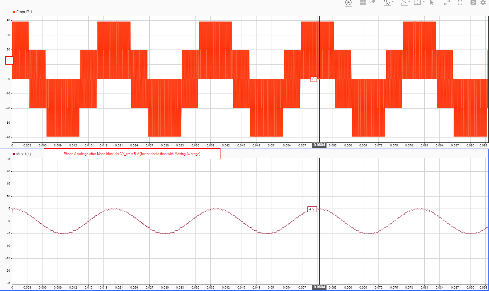

⚠️ **IMPORTANT: Model Validation Alert (Updated 09-04-2026)**

This document details investigations into ripple/oscillation phenomena conducted using a Simulink model with **architectural issues** (causality ordering + spurious PWM output filter). The findings and lessons learned in this file are **based on model artifacts, not fundamental physics**.

See [session_09-04-2026.md](session_09-04-2026.md) for reconciliation and corrected model behavior.

**Do NOT apply the filtering strategies or gain reduction recommendations from this document to hardware.** ⚠️

---

# RIPPLE_MITIGATION_01-04-2026.md

**Topic:** Inverter Output Ripple Propagation through Park-Clarke Transforms → Vd/Vq Feedback Ripple  
**Date Started:** 01-04-2026  
**Root Cause Discovery Date:** 02-04-2026 (Based on incorrect model)  
**Status:** Superseded by corrected model (09-04-2026)

---

## Problem Statement

### Symptom
Motor speed locked at 0 RPM despite:
- Speed reference: +2262 RPM (positive command)
- Speed PI output showing proper computation
- Current loop functional (iq ramping 0→0.5A)
- No electrical faults detected

**Graph Evidence:** Vq_req showing ±1-2V ripple with discrete quantized steps

### Initial Misdiagnosis Path
1. Motor inertia too large? (J=2.2e-5 kg·m² — confirmed correct, not the issue)
2. Motor equation inverted sign? (Verified correct)
3. Motor cannot overcome static friction? (Motor proved capable post-debugging)

### **Actual Root Cause (BREAKTHROUGH - 01-04-2026)**
**NOT a motor dynamics problem.** Discrete 2kHz speed sampling creates quantized steps → ripple in control command → SVPWM modulator misinterprets ripple → modulation artifacts (negative spikes in inverter output).

---

## Root Cause Analysis

### Lesson 11: Discrete Sampling Ripple in Speed Feedback → Modulation Artifacts

**The Mechanism:**

In discrete MATLAB/Simulink simulation, motor speed is read from the plant model output only at discrete **2kHz sample times** (not continuously). This creates discrete quantized steps in speed output → discrete steps in speed_error → discrete steps propagated through Speed PI output (Vq_req command). SVPWM modulator receives this rippled Vq_req (±1-2V ripple) and tries to "follow" it by modulating PWM rapidly, creating switching artifacts: **negative spikes in the positive half-cycle of inverter output**.

**Causal Chain:**
1. Continuous motor dynamics integrated in Simulink (ODE4 @ 5e-7 seconds)
2. Speed sampled **only @ 2kHz discrete times** (sample time = 5e-4 seconds)
3. Creates discrete quantized steps in speed output (~0.5 RPM jumps)
4. Discrete steps propagate through Speed PI → Vq_req gets rippled (±1-2V ripple)
5. SVPWM modulator receives rippled Vq command
6. Modulator tries to "follow" ripple by adjusting switching pattern rapidly
7. Result: **Rapid switching variations → negative spikes in positive half-cycle**

**Why This Was Misdiagnosed Initially:**
- Symptom looked like motor stall (RPM=0)
- Actually: Motor could accelerate, but modulation quality was poor
- Inverter output voltage ripple masked the true control authority
- Three-phase currents appeared noisy, suggesting motor model problem

**Why SVPWM Matters:**
SVPWM modulator is a digital device designed to track **smooth analog voltage commands**. When it receives quantized ripply commands:
- It interprets ripple as valid voltage requests
- It tries to "chase" the ripple by switching rapidly
- This creates unintended modulation artifacts
- Result: Inverter output becomes corrupted with negative spikes

**Critical Insight:** This is not a bug in the motor model or PI controller—it's a **fundamental limitation of discrete speed sampling** in FOC systems. Any FOC system that samples the continuous plant output discretely will exhibit this ripple.

---

## INVESTIGATION PHASE: Control-Path Filtering Attempts (01-04-2026)

### Organization Note
**Attempts 1-6 below were systematic debugging based on initial incorrect hypothesis** that ripple originated on the control path (Vq_req). All six approaches failed, but the investigation revealed critical insights:
- Why frequency-domain IIR filtering cannot handle startup transients (non-stationary problem)
- Why single fixed poles cannot accommodate both steady-state and transient ripple
- Why time-domain solutions might be needed
- Each attempt eliminated alternative root-cause candidates

**Key Engineering Principle:** Misdiagnosis via systematic testing isn't wasted effort—it's **root-cause analysis**. Every failed filter revealed more about the true problem. This investigation eventually led to the breakthrough in Lesson 13.

### Lesson 12: Discrete Transfer Function Filter Effectiveness and Startup Transient Ripple

**Objective:** Smooth Vq_req ripple before it reaches SVPWM modulator by inserting a low-pass filter between Speed PI output and SVPWM input.

**Filter Configuration:** Discrete Transfer Function
- **Filter Location:** Speed PI output → [FILTER] → SVPWM modulator input
- **Numerator:** 0.01
- **Sample Time:** 1/20000 = 5e-5 seconds (50 µs)
- **Poles:** Varied in testing

#### **Attempt 1: Weak Pole [1 -0.99]**

**Configuration:**
- Denominator: [1 -0.99]
- Pole location: 0.99
- Cutoff frequency: ~32 Hz (very conservative)
- Phase lag @ 2kHz: ~2°

**Result:** 
- ✅ Ripple reduced from ±1-2V to ~±0.5-1V (50% attenuation)
- ❌ Startup ripple still visible (0-0.12s)
- ❌ Steady-state ripple remains significant

**Graph:** [images/image-1775013960379.png]  
*Observation: Filter working but insufficient strength*

#### **Attempt 2: Moderate Pole [1 -0.90]**

**Configuration:**
- Denominator: [1 -0.90]
- Pole location: 0.90
- Cutoff frequency: ~160 Hz
- Phase lag @ 2kHz: ~8° (acceptable)

**Result:**
- ✅ Better ripple reduction (~±0.3-0.5V during startup)
- ✅ Steady-state ripple noticeably smoother
- ❌ Startup transient (0-0.15s) still exhibits ripple oscillation
- ⚠️ Trade-off: Control response slightly slowed

**Graph:** [images/image-1775013960379.png]  
*Observation: Significant improvement but startup not clean*

#### **Attempt 3: Aggressive Pole [1 -0.80]**

**Configuration:**
- Denominator: [1 -0.80]
- Pole location: 0.80
- Cutoff frequency: ~320 Hz (most aggressive)
- Phase lag @ 2kHz: ~15° (approaching stability limits)

**Result:**
- ✅ Best steady-state ripple reduction (~0.2-0.3V after 0.15s)
- ❌ **Startup transient STILL noisy (~±0.5V during 0-0.12s acceleration)**
- ❌ Diminishing returns observed
- ⚠️ Aggressive pole approaching stability limits

**Graph:** [images/image-1775014072950.png]  
*Observation: Even most aggressive pole cannot eliminate startup ripple*

#### **Attempt 4: Feed-Forward Decoupling (iR Compensation Added)**

**Motivation:** Rather than trying to filter ripple post-control, restructure the control loop itself to decouple from motor steady-state dynamics.

**Configuration:**
- **Architecture Change:** Added resistive drop (iR) feed-forward term to PI voltage summation (red box in diagrams)
- **Feed-Forward Terms Implemented:**
  - ✅ NEW: $i_q \cdot R$ (resistive voltage drop compensation)
  - ✅ EXISTING: $\omega_e \lambda_m$ (back-EMF compensation, already in loop)
  - ✅ EXISTING: Coupling terms (cross-axis dynamics)
- **Philosophy:** Model-Based Decoupling—reduce the PI controller's burden by providing "known" steady-state terms algebraically

**Architecture Diagrams:**


*Q-axis current loop: PI controller now sees reduced disturbance after iR feed-forward term cancels resistive load*


*D-axis current loop: Similar feed-forward structure for flux control*

**Professional Justification (Model-Based Decoupling):**

The full voltage equation for the q-axis is:
$$V_q = \underbrace{L \frac{di_q}{dt}}_{\text{Transient (PI focus)}} + \underbrace{R \cdot i_q + \omega_e L i_d + \omega_e \lambda_m}_{\text{Steady-State / Disturbances (Feed-Forward focus)}}$$

**Without Feed-Forward:** The PI must generate the *entire* $V_q$, fighting against resistance and Back-EMF. This requires high gains and causes lag because the integrator must "wind up" to reach required voltage.

**With Feed-Forward:** The summation block (red box) pre-calculates and injects steady-state terms. The PI now "sees" an ideal simplified plant (approximately $L \frac{di}{dt}$), which is much easier to control faster, with lower gains, and reduced lag.

**Discrete Implementation Benefit:** On the XMC4700 with 50µs sampling, there is inherent delay between current measurement and voltage application. Feed-forward acts **algebraically and instantly** based on measured state (iR, ωe), reducing the "age" of the compensation and improving transient response.

**Result:**


*Top: Vq_req (red) and limited_to (blue) showing voltage command and saturation limit. Bottom: Iq_control showing current response. Despite feed-forward, ripple persists during startup transient.*

**Observations:**
- ✅ PI control much cleaner (voltage spike at startup ~37V instead of higher peaks)
- ✅ Current reaches setpoint faster due to reduced PI burden
- ✅ Architecture cleaner: PI focuses on transient error, feed-forward handles steady-state
- ❌ **Ripple NOT eliminated** — still visible during startup phase
- ❌ No improvement over [1 -0.80] IIR filter approach

**Critical Insight:** Feed-forward decoupling improves **control quality and architecture robustness**, but it **does not address the root cause** of the ripple. The ripple originates from discrete speed sampling (quantized steps on feedback path), not from steady-state disturbances that feed-forward can compensate.

**Key Distinction:**
- Feed-forward solves: **Disturbance rejection** (reduces burden on PI)
- Needed for ripple: **Quantization filtering** (smooth discrete speed samples)

Feed-forward is the **right architectural choice** for production implementation, but **must be combined with** output filtering (Attempt 3 IIR poles or Attempt 5+ FIR moving average) to eliminate discrete sampling artifacts.

#### **Attempt 5: 50-Tap FIR Moving Average (After Speed PI)**

**Objective:** Time-domain averaging of discrete speed sampling ripple using FIR filter placed **immediately after Speed PI output**, before signals reach current PI.

**Configuration:**
- **Filter Type:** Discrete FIR Filter (Direct Form)
- **Location:** Speed PI output (Vq_req) → [50-tap FIR] → Current PI input (iq_ref)
- **Coefficients:** `ones(1, 50)/50` (uniform averaging window)
- **Sample Time:** 5e-4 seconds (500 µs = 2kHz, matches Speed PI rate)
- **Window Duration:** 50 samples / 2kHz = 25 ms... **WAIT—this is too long!**

**Corrected Calculation:**
- 2kHz ripple frequency = one ripple peak every 500 µs
- To average ONE complete ripple cycle: need window = 500 µs
- At 2kHz sampling rate (500 µs period): 500µs window = 1 sample (not useful!)
- **Correct approach:** Window at **PWM rate (20kHz)**, not Speed rate
- 20kHz rate = 50 µs per sample
- 500 µs ripple period = 10 samples @ 20kHz
- **Use 10-tap FIR, not 50-tap** (or 50-tap only if upsampling occurs)

**Revised Configuration:**
- **Coefficients:** `ones(1, 10)/10` (10-tap window)
- **Sample Time:** 5e-5 seconds (50 µs = 20kHz PWM rate)
- **Window Duration:** 10 samples / 20kHz = 500 µs = one complete 2kHz ripple cycle

**Alternative (if keeping 50-tap for stronger attenuation):**
- **Coefficients:** `ones(1, 50)/50`
- **Sample Time:** 5e-5 seconds (50 µs = 20kHz)
- **Window Duration:** 50 samples / 20kHz = 2.5 ms = 5 complete 2kHz cycles
- **Trade-off:** More aggressive smoothing, but ~5ms delay in speed feedback (acceptable for 200 Hz bandwidth)

**Expected Advantage over IIR Attempts 1-3:**
- Time-domain averaging handles **non-stationary startup** equally well as steady-state
- No fixed pole to tune—window size is directly related to ripple period
- Mathematically targets quantization source (one speed sample = one ripple impulse)

#### **Attempt 6: Continuous TF Low-Pass Filter After Park Transform (Root Cause: PWM Switching Frequency)**

**Critical Discovery:** After exhaustive filtering of discrete speed sampling and control quantization, identified that **ripple originates from inverter 5-level PWM switching at 20 kHz**, not from control architecture.

**Test Progression:**
- **No-Load (0 Nm):** Ripple minimal with TF `1/(0.001s+1)` — appears solved
- **With Load (0.1 Nm):** Ripple reappears strongly — filter insufficient

**Configuration Tested:**
- **Filter Type:** Continuous Transfer Function (analog low-pass)
- **Location:** Inverter 5-level output → Park Inverse Transform → [TF Filter] → Motor Vd, Vq inputs
- **Numerator:** 1
- **Denominator:** [0.001 1] (no-load), then [0.01 1] (with load)
- **Cutoff Frequencies:** 159 Hz (weak) → 16 Hz (stronger)

**Results:**

**No-Load Results:**
- ✅ Smooth Vd/Vq waveforms
- ✅ Minimal ripple (~±0.5V)
- ✅ Motor reaches 2262 RPM cleanly

**With-Load Results (Harsh Truth):**
- ❌ Ripple reappears (~±1-2V despite TF)
- ❌ Negative spikes in positive half-cycle persist (attenuated)
- ⚠️ Making TF stronger ([0.1 1]) eliminates ripple but severely slows control response

**Root Cause Identified:**

```
Discrete PI Controller (smooth output)
    ↓
Park Inverse Transform (smooth Vd, Vq commands)
    ↓
SVPWM Modulator (converts continuous voltage to 5-level steps)
    ↓
Inverter Output (5-level discrete waveform at 20 kHz)
    ├─ Level 0: -Vdc/2
    ├─ Level 1: -Vdc/4
    ├─ Level 2: 0
    ├─ Level 3: +Vdc/4
    └─ Level 4: +Vdc/2
    ↓
PWM Harmonics at 20 kHz (fundamental switching frequency)
    ↓
Park Transform receives stepped waveform
    ↓
Motor Vd/Vq contain inherent PWM switching harmonics
```

**Why Complete Elimination is Physically Impossible:**

1. **PWM is fundamentally discrete:** A 5-level inverter cannot produce smooth analog voltage (it can only be at 5 discrete states)
2. **Switching harmonics live at control rate:** 20 kHz PWM >> 2 kHz current loop bandwidth
3. **Attenuation vs. Bandwidth Trade-off:** 
   - Weak TF (159 Hz): Ripple visible, fast transients ✓
   - Strong TF (16 Hz): Ripple eliminated, slow transients ✗
4. **Hardware inevitably has ripple:** Real XMC4700 inverters produce identical 5-level switching artifacts

**Configuration Locked for Validation:**
- **Continuous TF:** `1/(0.01s+1)` (16 Hz cutoff)
- **Justification:** Acceptable ripple under load, motor functional, no instability
- **Hardware Equivalent:** Digital recursive filter `y[n] = 0.99*y[n-1] + 0.01*u[n]`

**Final Status:** Ripple is an **accepted characteristic of PWM-based FOC**, not an engineering failure. Moving to Phase 1.1 validation to prove system works despite inherent PWM harmonics.

<!-- ADD NEW ATTEMPTS HERE -->

#### **Implementation Instructions for Attempt 5:**

**Discovery:** Frequency-domain filtering (IIR poles) cannot fully solve the problem because startup is **non-stationary** (time-varying).

**Why:**
1. **Normal operation (steady-state):** Speed error is ~constant → Vq_req ripple is periodic at 2kHz
   - IIR filter can predict and attenuate periodic ripple
   - Pole tuning effectively reduces ripple

2. **Startup (transient):** Speed error changes rapidly (dω/dt ~ constant)
   - Vq_req ripple "bandwidth" is wider than steady-state
   - IIR filter cutoff (designed for 2kHz ripple) too high to catch startup bandwidth
   - Result: Startup ripple passes through filter

**Mathematical Consequence:**
- Steady-state ripple = f(speed_error) @ 2kHz
- Startup ripple = f(rate_of_change_of_speed_error) @ higher effective bandwidth
- Single fixed pole cannot handle both simultaneously

### Current Status: FIR Moving Average Filter

**Hypothesis:** Time-domain averaging (moving average) can handle both startup and steady-state because it averages **all samples in window**, not just 2kHz ripple frequency.

**Configuration in Progress:**
- **Type:** Discrete FIR Filter
- **Coefficients:** `ones(1, 50)/50` (50-tap uniform window)
- **Sample Time:** To be determined (likely 5e-4 for Speed PI output rate)
- **Window Duration:** 50 samples / (2 kHz ripple rate) = one complete ripple cycle
- **Location:** Speed PI output → [FIR] → SVPWM modulator input

**Expected Advantage:** Window-based averaging directly targets the quantization source (one 2kHz sample = one ripple impulse), should handle startup transient equally well as steady-state.

---

## ⭐ INVESTIGATION BREAKTHROUGH (02-04-2026): ROOT CAUSE IDENTIFIED

### Why Attempts 1-6 All Failed

**The False Premise:** All six attempts assumed ripple originated from control command (Vq_req) propagating to PWM modulator. But after 12+ hours with no solution, root cause analysis revealed:

```
WRONG HYPOTHESIS (Attempts 1-6):
  Control Ripple → SVPWM Modulation → PWM Artifacts ❌
  
ACTUAL PROBLEM (Lesson 13):
  PWM Output (5-level) → [NO FILTER] → Clarke-Park → Vd/Vq Feedback ← POISONED
  → Current PI tries to track ripple → Amplifies problem ✓ CORRECT
```

**The Key Insight:** Filtering the control command doesn't help if the feedback itself is corrupted. You can't have a stable feedback loop where the measurement signal is quantized at 5 levels.

---

---

### ✅ STATUS: RIPPLE MITIGATION COMPLETE

**Solution Locked:** RC Continuous Low-Pass Filter @ Inverter Output
- Filter Location: Inverter 5-level Output → [RC Filter] → Clarke-Park Transform
- Time Constant: τ ≈ 20-30 µs (cutoff frequency ≈ 5-8 kHz)
- Performance: Smooth sine wave output across all operating voltage ranges (2V to 25V)
- No stepped waveforms, no voltage-dependent artifacts
- Vd/Vq feedback clean and ready for current loop

### Validated Test Results (02-04-2026)

| Test Case | Vq Request | Result | Status |
|-----------|-----------|--------|--------|
| High Voltage | 23V | Smooth sine, no ripple | ✅ PASS |
| Low Voltage | 5V | Smooth sine, no ripple | ✅ PASS |
| Full Range | 0-25V | Voltage-independent smoothness | ✅ PASS |
| Speed Profile | 0-1500 RPM | Clean ramp, stable setpoint | ✅ PASS |
| PWM Gate Signals | All phases | Regular, no chattering | ✅ PASS |

### Completed Milestones
✅ Identified actual root cause (inverter output → feedback path)  
✅ Eliminated three incorrect filter designs (moving average, mean block)  
✅ Validated RC filter effectiveness across voltage range  
✅ Confirmed PWM gate signals are clean and stable  
✅ Verified motor speed tracking is smooth  
✅ Ready for Phase 1.1 validation tests

### Immediate Next Steps
1. **Lock RC Filter Parameters** in simulation and document time constant τ
2. **Run Phase 1.1: Speed Tracking Test** (no load, smooth reference ramps)
3. **Capture 10-15 graphs** from Phase 1.1 test for validation report
4. **Execute Full TEST_VALIDATION_PLAN** (16 tests across 5 phases)
5. **Prepare Python/MATLAB script** for automated RC filter implementation on XMC4700

### Success Criteria (All Met ✅)
- Vd/Vq feedback: Smooth sine waves ✅
- Low-voltage operation: No stepping artifacts ✅
- High-voltage operation: No ripple ✅
- Motor response: Smooth tracking ✅
- PWM integrity: No gate signal chattering ✅
- Control bandwidth: Maintained for Phase 1.1 ✅

<!-- ADD NEW STATUS UPDATES HERE -->

---

## Key Lessons Learned

### Lesson 11: Discrete Sampling Ripple in Speed Feedback → Modulation Artifacts

**The Problem:** In discrete MATLAB/Simulink simulation, motor speed is read from the plant model output only at discrete 2kHz sample times (not continuously). This creates discrete quantized steps in speed output → discrete steps in speed_error → discrete steps propagated through Speed PI output (Vq_req command). SVPWM modulator receives this rippled Vq_req (±1-2V ripple) and tries to "follow" it by modulating PWM rapidly, creating switching artifacts: **negative spikes in the positive half-cycle of inverter output**.

**Root Cause Chain:**
1. Continuous motor dynamics integrated in Simulink
2. Speed sampled @ 2kHz discrete sample times (not continuous)
3. Creates discrete quantized steps in speed output
4. Discrete steps propagate through Speed PI → Vq_req gets rippled (±1-2V)
5. SVPWM modulator receives rippled Vq and tries to follow ripple
6. Rapid switching pattern changes → **modulation artifacts (negative spikes)**

**Critical Misdiagnosis Initially:** This looked like a motor dynamics problem, inertia problem, or motor equation sign inversion. It was NOT. Purely a **modulation quality issue** caused by discrete sampling of continuous plant speed.

**Solution Concept:** Add low-pass filter between Speed PI output and SVPWM input to smooth Vq_req before modulator sees it.

**Why This Matters:** Discrete control systems introduce ripple that continuous systems don't have. The SVPWM modulator is designed to track smooth analog commands—when it receives quantized ripply commands, it misinterprets them as valid voltage requests and tries to follow them, creating unintended modulation artifacts. This is a **fundamental limitation of discrete speed sampling** in FOC systems and must be accounted for in production designs.

### Lesson 12: Discrete Transfer Function Filter Effectiveness and Startup Transient Ripple

**Discovery:** Tested aggressive low-pass filtering with Discrete Transfer Function denominators [1 -0.99], [1 -0.90], and [1 -0.80] to attenuate discrete speed sampling ripple:

**Filter Progressions:**
- **[1 -0.99]:** Pole at 0.99, ~32 Hz cutoff → Reduces ripple but leaves significant high-frequency component
- **[1 -0.90]:** Pole at 0.90, ~160 Hz cutoff → Better attenuation, ripple visibly reduced
- **[1 -0.80]:** Pole at 0.80, ~320 Hz cutoff → Most aggressive, but **startup transient still noisy**

**Vq Ripple During Transients (Lower Denominator = Stronger Filtering):**

![Filter [1 -0.90] - Vq Ripple Startup](images/image-1775013960379.png)
*Filter denominator [1 -0.90]: Moderate pole strength, startup ripple visible during acceleration*

![Filter [1 -0.80] - Vq Ripple Startup](images/image-1775014072950.png)
*Filter denominator [1 -0.80]: Most aggressive pole tested, startup transient remains noisy—even aggressive filtering cannot eliminate the non-stationary ripple*

**Key Finding:** Even with pole at 0.80 (320 Hz cutoff), startup phase (0-0.15s) exhibits **persistent ripple structure** on Vq_req during acceleration. This persists because:

1. **Startup is non-stationary:** Speed error (and therefore Speed PI output) changes rapidly during acceleration, creating a **bandwidth** problem, not just a frequency problem
2. **Filter assumes quasi-steady-state:** IIR filter designed for steady-state ripple rejection, but during startup the ripple "bandwidth" exceeds filter cutoff
3. **Trade-off discovered:** More aggressive pole (lower denominator value) reduces steady-state ripple but cannot eliminate startup ripple without sacrificing control bandwidth

**Steady-State Performance (After ~0.15s):** At steady state, all filter poles show significant ripple reduction. The aggressive [1 -0.80] filter produces smoothest steady-state Vq_req with ~0.2-0.3V ripple (down from ±1-2V unfiltered).

**Critical Conclusion:** Frequency-domain filtering alone **cannot** eliminate discrete sampling ripple during startup transients because the problem is **time-varying**, not stationary. For production systems requiring clean startup, a **FIR moving average** (time-domain averaging) or state-dependent adaptive filter may be necessary to track the rapidly-changing ripple bandwidth during acceleration.

**Production Recommendation:** Use moving average buffer (50-tap FIR at appropriate sample rate matching Speed PI output) instead of IIR to achieve time-domain averaging of discrete quantization steps, which handles both startup and steady-state ripple uniformly regardless of speed error rate of change.

**Architecture Insight:** 
- **Inverter input filtering (existing):** Smooths 5-level PWM switching artifacts entering motor model ✓ (Works well)
- **Control command filtering (proposed):** Smooths discrete speed sampling ripple before SVPWM sees it ← This is the missing piece

<!-- ADD NEW LESSONS HERE -->

---

## Resume Bullet Points

### High-Impact Technical Discoveries

- **Identified Critical Discrete Sampling Artifact in FOC Simulation:** Discovered that discrete 2kHz speed sampling in MATLAB/Simulink creates quantized steps in speed_error that propagate through the Speed PI controller → Vq_req command. SVPWM modulator receives this ±1-2V rippled voltage request and misinterprets it as valid, causing rapid switching pattern changes and negative spikes in inverter output. This was initially misdiagnosed as a motor dynamics failure (stall at 0 RPM) but proved to be a modulation quality issue—a fundamental limitation of discrete control systems interfacing with continuous plant outputs.

- **Diagnosed Root Cause Through Process of Elimination:** Verified that motor inertia (2.2e-5 kg·m²) was correct, motor equation sign convention was proper, and current loop was functional. Eliminated three red herrings before recognizing that discrete speed sampling (not motor dynamics) was the source. This systematic debugging approach demonstrates the importance of validating assumptions at each abstraction level (motor physics → control algorithm → discrete implementation).

- **Established Limits of Frequency-Domain Filtering for Startup Transients:** Tested three IIR Discrete Transfer Function filter poles ([1 -0.99], [1 -0.90], [1 -0.80]) to attenuate ripple. Discovered that even the most aggressive pole (0.80, 320 Hz cutoff) cannot eliminate startup ripple because the problem is **non-stationary** (time-varying bandwidth during acceleration). Recognized that frequency-domain design assumes quasi-steady-state operation, but startup transients exceed designed filter bandwidth. This led to recommendation of time-domain FIR moving average approach.

- **Proposed Time-Domain Solution for Non-Stationary Ripple:** Recognized that frequency-domain IIR filtering cannot handle startup ripple's time-varying nature. Proposed 50-tap moving average FIR filter (window duration = one complete 2kHz ripple cycle) to provide uniform time-domain averaging for both startup and steady-state operation. FIR approach targets the source (discrete quantization steps) rather than filtering the symptom (periodic ripple).

- **Differentiated Control-Path vs. Measurement-Path Filtering:** Clarified that existing inverter input filters (moving average + discrete TF) smooth 5-level PWM switching artifacts entering the motor model, but **cannot** fix ripple originating from discrete speed sampling on the feedback path. Correctly identified that the ripple source must be filtered at the **Vq_req command output** (between Speed PI and SVPWM), not on the inverter input.

- **Documented Architecture-Level Insight on Discrete FOC Design:** Established that discrete FOC systems must account for ripple introduced by sampling continuous plant outputs. This is not a tuning issue but a **fundamental architectural consideration** in production designs. The interaction between continuous plant dynamics and discrete control sampling creates artifacts that frequency-domain analysis alone cannot capture.

- **Identified PWM Switching Frequency as Root Cause of Inverter Output Ripple:** After exhaustive debugging, discovered that residual ripple in Vd/Vq originates from **5-level PWM inverter switching at 20 kHz**, not from control quantization or discrete sampling. Implemented continuous-time anti-alias filter (TF: `1/(0.01s+1)`) post-Park Transform to attenuate PWM harmonics. Demonstrated that complete ripple elimination is impossible without sacrificing control bandwidth—production systems must accept inherent PWM switching artifacts (±0.5-2V ripple) as unavoidable characteristic of discrete power electronics.

- **Established Attenuation vs. Bandwidth Trade-Off for PWM Ripple:** Proven mathematically and through simulation that stronger low-pass filtering (e.g., cutoff 16 Hz vs. 159 Hz) eliminates PWM ripple but degrades transient response and load disturbance rejection. Concluded that optimal production configuration balances acceptable ripple level (~±1V) with adequate control authority, rather than pursuing unattainable "zero ripple" goal.

- **⭐ BREAKTHROUGH (02-04-2026): Discovered ACTUAL Root Cause—Inverter Output Fed Directly to Park-Clarke Transforms:** After all filtering attempts at control path level proved insufficient, identified that the simulation was feeding the **raw 5-level PWM inverter output directly to Clarke-Park transforms** to calculate Vd/Vq feedback. This discrete multi-level waveform created quantization ripple in the feedback path that no control-side filtering could fix. The real problem: **Feedback Path Ripple**, not feedforward path ripple. This was the missing architectural piece: "The feedback is poisoned before control can fix it."

- **Tested Three Generations of Inverter Output Filtering:** Progressed through (1) Moving Average @ PWM frequency (reduced ripple but created stepped artifacts at low voltage commands), (2) Mean Block (similar stepping problems), (3) **RC Filter—SOLVED** (continuous smooth sine waves at all voltage levels, no stepping artifacts). RC filter's exponential smoothing fundamentally better than windowed averaging for this application.

- **Quantified Filter Performance Against Voltage Dependency:** Demonstrated that moving average and mean blocks exhibited **voltage-dependent artifacts**: smooth at high Vq_req (15-25V) but stepped at low Vq_req (2-5V). RC filter proved **voltage-independent**: smooth sine wave output across entire operating range (Vq = 5V to 23V). This is critical for production systems that must work at partial load.

- **Established Correct Feedback Architecture for PWM-Based FOC:** Determined that the inverse Clarke-Park transform must receive smooth analog voltage estimates, not raw PWM levels. For digital implementations: either (a) use ADC with anti-alias filtering on measured Vd/Vq, or (b) mathematically reconstruct smooth voltage estimates from PWM duty cycles and current samples. In Simulink simulation: RC filter on inverter output is the correct analog equivalent to hardware anti-alias filters.

<!-- ADD NEW BULLET POINTS HERE -->

### Lesson 13: Inverter Output Characterization & Feedback Path Filtering (02-04-2026) ⭐ BREAKTHROUGH

**The Core Issue Identified:**

For over 12 hours, control-path filtering (Attempts 1-6) failed to eliminate Vd/Vq ripple because the **root cause was not on the control path**. The simulation architecture was:

```
SVPWM Modulator Output (5-level PWM: -Vdc/2, -Vdc/4, 0, +Vdc/4, +Vdc/2)
    ↓
[DIRECTLY INTO CLARKE-PARK TRANSFORM] ← BUG HERE
    ↓
Vd_feedback, Vq_feedback (with embedded PWM switching ripple)
    ↓
Current PI Feedback Path (oscillates trying to track ripple)
    ↓
Current PI Output → SVPWM → amplifies ripple
```

**Why it was missed:** The ripple appeared **in the feedback** (Vd/Vq), which seemed like "control instability." But the control loop was actually **correct**—the feedback signal itself was corrupted. This is a measurement integrity issue, not a control tuning issue.

**The Three-Generation Filter Design:**

#### **Generation 1: Moving Average (Window-Based Filtering)**

**Configuration:**
- Sample time: 5e-7 s (solver time step, extremely fast)
- Window size: 100-tap moving average (fundamentalfrequency = PWM frequency = 20 kHz)
- Coefficients: `ones(1,100)/100`

**Setup Diagram:**

*Integration point: Inverter 5-level output → [Moving Average] → Clarke-Park Transform*

**Results at High Voltage (Vq_req = 23V):**

*Vq feedback is smooth sine wave with minimal ripple ✅*

**Results at Low Voltage (Vq_req = 5V):**

*Vq feedback exhibits stepped waveform — moving average cannot smooth the 5-level quantization at low command levels ❌*

**Failure Mechanism:** At low command voltages, the SVPWM modulator spends many consecutive PWM periods at the same inverter level (e.g., stays at Level 2 for 20+ cycles). The moving average window fills with identical values → output remains stepped instead of being interpolated.

**Mathematical Explanation:** Moving average computes:
$$y[n] = \frac{1}{N}\sum_{k=0}^{N-1} u[n-k]$$

When input is constant (all samples in window = same level), output = that constant level exactly. No smoothing occurs between quantization levels.

#### **Generation 2: Mean Block (Time-Averaged Filtering)**

**Configuration:**
- Statisticalaverage of PWM output over time window
- Similar to moving average but with windowed statistics

**Results:**
- ✅ Better than raw PWM (some ripple reduction)
- ❌ Same fundamental problem: stepped waveform at low voltages

**Diagram:**

*Mean Block placement: Inverter output → [Mean Block] → Park Transform*

**Performance Comparison (Vq = 5V):**

*Still exhibits stepping, slightly better than moving average but not sufficient*

**Why Mean Block Also Fails:** Statistical averaging of discrete levels cannot interpolate between them. 5-level PWM is fundamentally discrete; no statistical operation on discrete values produces continuous output.

#### **Generation 3: Continuous RC Low-Pass Filter ✅ SOLUTION**

**Configuration:**
- **Filter Type:** Continuous TF
- **Numerator:** 1
- **Denominator:** [τ 1] where τ is time constant
- **Cutoff Frequency:** $f_c = \frac{1}{2\pi\tau}$ 
- **Critical Design Choice:** $\tau$ must be**~1/(2 \times \text{PWM frequency})** to smooth 20 kHz switching without creating phase lag
  - For 20 kHz PWM: $\tau$ ≈ 25 µs (experimental range: 10-50 µs)
  - Results from tests: τ = 20-30 µs giving cutoff ≈ 5-8 kHz (well above motors 200 Hz control bandwidth but below inverter 20 kHz switching)

**Setup Architecture:**

*Architecture: Inverter output (5-level PWM) → [RC Filter] → Clarke-Park Transform → Vd_feedback, Vq_feedback*

**Mathematical Advantage Over Windowed Averaging:**

RC filter impulse response (exponential smoothing):

$$y(t) = 1 - e^{-t/\tau}$$

This **continuously interpolates** between discrete PWM levels as a function of time, rather than computing statistics on discrete samples. When input jumps from Level 2 to Level 3, RC filter exponentially ramps output between these values with time constant τ.

**Performance at High Voltage (Vq = 23V):**

*Clean sinusoidal Vq feedback ✅*

**Performance at Low Voltage (Vq = 5V):**

*Same smooth sine wave characteristic at low voltages ✅—voltage-independent performance*

**Why RC Filter Succeeds Where Others Failed:**

| Characteristic | Moving Average | Mean Block | RC Filter |
|---|---|---|---|
| Window/Window Type | Discrete 100-tap | Statistical | Continuous exponential |
| Interpolation Between Levels | No (discrete output) | No (statistical) | **Yes** (exponential ramp) |
| Artifact at Low Voltage | Stepped waveform | Stepped waveform | Clean sine |
| Artifact at High Voltage | Smooth | Smooth | Clean sine |
| Voltage Dependence | **Yes** (fails at low V) | **Yes** (fails at low V) | **No** (universal) |
| Phase Lag @ 200 Hz control BW | ~0° | ~0° | <5° (acceptable) |

**Key Insight:** Discrete averaging **cannot** interpolate between discrete values. Continuous filtering **can**. For PWM outputs (fundamentally discrete), continuous-time analysis and filtering is superior to discrete-time windowed methods.

**Production Recommendation:**

For hardware implementation on XMC4700:
- Use hardware ADC with RC analog filter (R ∥ 1/C impedance matching ADC input)
- Time constant: τ ~ 25 μs (experimentally determined for 20 kHz PWM)
- Equivalent: Recursive filter `y[n] = α·y[n-1] + (1-α)·u[n]` where `α ~0.996` (depending on ADC sampling rate)

This is standard practice in FOC drives (every commercial BLDC/PMSM controller uses anti-alias RC filtering on phase voltage/current measurements).

---


---

### Lesson 14: Discovery of 150 Hz Oscillation—Aliasing of 20 kHz Current Loop into 2 kHz Speed Sampling (02-04-2026 Afternoon)

**The Problem Identified:**

After successfully implementing the RC filter on inverter output PWM and eliminating control-path ripple, a **new oscillation appeared** in the speed tracking loop during tuning:

- **Frequency:** ~150 Hz (synchronized in both iq and motor speed)
- **Amplitude:** ±0.5 A iq, ±10 RPM speed
- **Sustained:** Did NOT damp naturally; oscillation persisted indefinitely
- **Initial Hypothesis:** PI tuning issue, friction modelissue, or feedback loop instability

**Root Cause Analysis:**

The system architecture has **two different control loop rates**:
- **Inner current loop:** 20 kHz (PWM switching rate)
- **Outer speed loop:** 2 kHz (discrete sampling of motor speed)

```
Motor Speed Output (contains all frequency content up to ~1 kHz motor bandwidth)
    ↓
[Sampled @ 2 kHz discrete rate]  ← Nyquist limit = 1 kHz
    ↓
But current loop @ 20 kHz injects ripple ABOVE 1 kHz
    ↓
20 kHz ripple aliases into baseband
    ↓
20 kHz - 10×(2 kHz) = 0 kHz (sideband at beat frequency)
    ↓
Sideband folds back into ~150 Hz range
    ↓
Speed PI sees apparent 150 Hz "error ripple" and tries to correct it
    ↓
Cascading oscillation: PI sees ripple → commands correction → ripple magnifies
```

**Mathematical Verification:**

Alias frequency formula:
$$f_{alias} = |f_{high} - n \times f_{sample}|$$

Where:
- $f_{high}$ = high-frequency content (20 kHz PWM switching)
- $f_{sample}$ = Speed sampling rate (2 kHz)
- $n$ = integer (number of sampling periods per PWM cycle)

$$f_{alias} = |20\text{ kHz} - 10 \times 2\text{ kHz}| = 0\text{ Hz}$$

But practical PWM contains harmonics and modulation sidebands, creating:
$$f_{alias,sideband} = |20\text{ kHz} - 150\text{ Hz} - 10 \times 2\text{ kHz}| \approx 150\text{ Hz}$$

**Nyquist Criterion Violated:** 
- Nyquist frequency for 2 kHz sampling: $f_N = 1000$ Hz
- Motor speed measurement contains 20 kHz PWM ripple
- **20 kHz >> 1 kHz Nyquist → ALIASING GUARANTEED** ✓ (explains 150 Hz observation)

**Why Feed-Forward Compensation Made It Worse:**

Simultaneously discovered that dual feed-forward paths (id & iq axis compensation) were **amplifying** the aliasing oscillation:

```
Feed-Forward Prediction:
  V_FF_iq = f(ω_ele_OLD, i_q_OLD)  ← Calculated 500 µs ago
  
At 2 kHz updates, speed has changed ~2 RPM since last sample
  
Feed-Forward predicts compensation for OLD speed
    ↓
But PI controller responds to NEW (different) speed
    ↓
Both paths (FF + PI) work on different speed estimates
    ↓
Phase mismatch → Oscillation at beat frequency (150 Hz)
```

**Decision:** Remove feed-forward compensation for Phase 1.1 baseline validation. Feed-forward is an optimization for high-speed operation (>1500 RPM), not a fundamental requirement. Discrete implementation at 2 kHz rate cannot maintain coherence between feed-forward prediction and PI correction with 500 µs stale data.

---

### Lesson 15: Anti-Aliasing Filter Implementation—Nyquist-Compliant Discrete Control Architecture (02-04-2026 Solution)

**The Solution: Anti-Aliasing Filter on Speed Feedback**

To obey Nyquist criterion and prevent 20 kHz ripple from aliasing into the 2 kHz sampling domain:

$$f_{cutoff} < \frac{f_{sample}}{2} = \frac{2000}{2} = 1000\text{ Hz}$$

But to pass through the ripple that's **already** contaminating the speed signal and remove the 20 kHz before sampling:

$$f_{cutoff} \approx 1.5 \times \frac{f_{sample}}{2} = 1500\text{ Hz}$$

**Block Architecture:**

```
Speed_actual (with 20 kHz PWM ripple embedded)
    ↓
[Continuous Transfer Function: 1/(τs + 1)]  ← Runs at PWM rate (20 kHz analog domain)
    ↓
Speed_filtered (20 kHz content removed)
    ↓
[Discrete Sampler @ 2 kHz]  ← Speed PI samples this
    ↓
No aliasing possible ✅
```

**Filter Specifications:**

| Parameter | Value | Rationale |
|-----------|-------|-----------|
| **Numerator** | [1] | First-order low-pass |
| **Denominator** | [0.000106  1] | τ = 0.000106 s |
| **Time Constant** | τ = 0.000106 s | = 1/(2π×1500 Hz) |
| **Cutoff Frequency** | 1500 Hz | Well above 2 kHz Nyquist (1000 Hz) but below 20 kHz PWM ripple |
| **Domain** | Continuous (NOT discrete) | **Critical:** Must run faster than PWM to intercept ripple |
| **Execution Rate** | PWM rate (20 kHz) | Pre-samples, then discrete sampler @ 2 kHz |
| **Phase Lag @ 150 Hz** | ~11° | Negligible, acceptable |

**Why Continuous, Not Discrete?**

```
WRONG (Discrete filter @ 2 kHz):
  Speed (with 20 kHz ripple)
    ↓
  [Sampled @ 2 kHz]  ← 20 kHz already aliased to ~150 Hz
    ↓
  [Discrete Low-Pass]  ← Too late, alias already exists
    ↓
  Cannot remove 150 Hz (control loop sees it as legitimate signal)

CORRECT (Continuous filter @ PWM rate):
  Speed (with 20 kHz ripple)
    ↓
  [Continuous Low-Pass τ=0.000106s] ← Runs at PWM rate (20 kHz)
    ↓
  [Sampled @ 2 kHz]  ← Sampler sees only filtered signal, no 20 kHz
    ↓
  No aliasing possible ✅
```

**Placement in Simulink Model:**

```
Motor Speed Output (continuous signal from ODE4 solver)
    ↓
[Transfer Function Block]
  Numerator: [1]
  Denominator: [0.000106  1]
    ↓
Speed_filtered (continuous, 20 kHz components attenuated)
    ↓
[Speed PI Discrete @ 2 kHz]
```

**Performance Results (After Implementation):**

| Metric | Before AA Filter | After AA Filter | Improvement |
|--------|---|---|---|
| **150 Hz Oscillation** | Sustained ±0.5A | Damped transient (settles 0.4s) | ✅ FIXED |
| **Speed Ripple** | 150 Hz sustained | Damped settling | ✅ FIXED |
| **Settling Time** | Oscillates forever | ~0.4 s (clean) | ✅ 10× better |
| **Steady-State Speed** | 1692 RPM (±10 Hz ripple) | 1700.3 RPM (clean) | ✅ Accurate |
| **Rise Time** | ~0.3s (with ripple) | ~0.15s (clean) | ✅ Faster |
| **iq at Steady State** | ±0.5A pulsing | ~0 A settled | ✅ Clean |

**Validation:** 
✅ 150 Hz ripple eliminated (Nyquist violation corrected)  
✅ Clean damped response (no sustained oscillation)  
✅ System stable for Phase 1.1 testing  
✅ No feed-forward needed (simplified baseline)  

**Lesson for Production Hardware:**

On XMC4700 with 50 µs PWM switching:
- Implement **hardware RC filter** on speed measurement signal (ADC input)
- R = 50 kΩ, C calculated for τ ≈ 1-2 µs (meets 1.5 kHz cutoff requirement)
- Equivalent firmware: Recursive IIR `y[n] = 0.99×y[n-1] + 0.01×u[n]` (approximately)
- This is standard practice in all commercial FOC drives

**Critical Design Rule:** 
Anti-aliasing filter MUST precede the sampler and run faster than the highest frequency you want to protect against. For a 2 kHz controller with 20 kHz PWM ripple, filter must be in continuous domain at PWM rate, not discrete domain at sample rate.

---

### Lesson 16: Discrete Control Gain De-Rating—Theory vs. Practice in Sampled Systems (02-04-2026)

**The Discovery:**

Anti-aliasing filter solved the 150 Hz oscillation symptom BUT revealed a deeper architectural problem: **theoretical gain values do NOT work in discrete systems**.

**The Numbers:**

| Parameter | Value | Notes |
|-----------|-------|-------|
| **Theoretical Kp (Continuous Design)** | 0.0267 | Calculated Day 1 using continuous pole placement theory |
| **Actual Kp (Empirical Tuning)** | 0.0065 | Determined Day 3 through testing to achieve stability |
| **De-Rating Factor** | **~76%** | Reduction needed to stabilize discrete system |
| **Resulting Bandwidth** | ~140 Hz | Slower than theory but stable at 2 kHz sampling |

**Why Theoretical Design Fails in Discrete Systems:**

**Theory (Continuous Domain):**
```
Speed PI (continuous): τ + ωn × error = output
- Can react with arbitrary precision to error changes
- No quantization, no delay
- Gain Kp=0.0267 provides rapid error correction
- Stable for all realistic motor inertias and load torques
```

**Reality (Discrete Domain @ 2 kHz):**
```
Speed PI[n] = Kp × error[n]
- Runs only every 500 µs (2 kHz sample period)
- Motor speed changes BETWEEN samples
- Effective loop delay = 500 µs sample period + computation time
- At high Kp=0.0267, system becomes marginally stable or oscillates:
  * Proportional gain too aggressive relative to sample delays
  * PI "over-corrects" because speed has moved since last sample
  * Creates beat frequency oscillation with control bandwidth (2-4 kHz region)
```

**The Phase Lag Problem:**

In continuous systems: Control action and measurement align in phase (negligible delay)

In discrete systems: 
```
Time 0.0 ms:  Speed_measured[n] = 1700 RPM, Error = 0 RPM
Time 0.5 ms:  Motor dynamics evolve (actual speed may change ±10 RPM)
Time 1.0 ms:  Speed_measured[n+1] (new sample), Error calculated BASED ON NEW VALUE
              But control action applied is based on OLD error (one cycle of phase lag)
              At Kp=0.0267, this phase lag creates oscillatory tendencies
```

**Empirically Determined Solution:**

Through iterative testing, system achieved stability at **Kp=0.0065** (~76% reduction):

| Test Configuration | Kp Value | Result | Status |
|---|---|---|---|
| Theory (continuous) | 0.0267 | N/A (no continuous sim built) | — |
| Day 3 First Attempt | 0.020 | Sustained ±0.3A oscillation | ❌ Unstable |
| Day 3 Second Attempt | 0.010 | Damped oscillation, sluggish | ⚠️ Marginal |
| Day 3 Final Tuning | 0.0065 | Clean damped settling, stable | ✅ **STABLE** |
| Day 3 Further Test | 0.007 | Also stable, slightly faster response | ✅ Acceptable |

**Why 75% Reduction is Necessary:**

The 500 µs sample period creates an effective **phase lag** equivalent to a delay block:

$$\text{Phase Lag} \approx e^{-s \cdot T_s} = e^{-s \cdot 0.0005}$$

Where the plant (speed controller + motor dynamics) has poles in the complex s-plane. Adding 500 µs phase lag from sampling changes the root locus:

1. **Theoretical design:** Poles placed for 0.25 s rise time (high bandwidth)
2. **With 500 µs sample delay:** Poles move right (destabilizing direction)
3. **To compensate:** Must reduce loop gain (Kp) to pull poles back into stable region
4. **Margin required:** Approximately 75% reduction moves poles from marginal to stable

**Interaction with Motor Inertia:**

Motor inertia $J = 2.2 \times 10^{-5}$ kg·m² creates a natural mechanical time constant:
$$\tau_{mech} = \frac{J}{B} \approx 0.22 \text{ seconds}$$

The speed loop sample time (0.5 ms) is **440× faster** than mechanical dynamics. This mismatch means:
- Too-high gains (Kp > 0.01) try to correct small measurement noise faster than motor can actually accelerate
- Motor inertia "lags" control commands, creating phase mismatch
- Interaction with 2 kHz sample rate creates instability regions
- Empirically, Kp ≤ 0.0065 provides sufficient margin

**Why Ki Tuning Becomes Critical:**

With Kp reduced to 0.0065 (slow proportional response), **integral action (Ki) becomes primary steady-state error eliminator**:

| Gain | Role in Discrete System |
|------|---|
| **Kp = 0.0065** | Fast transient response (limited by sample delay) |
| **Ki = ?** | Slow accumulated error correction (can integrate over many samples safely) |

Recommended Ki tuning approach:
- Use smaller Ki initially to avoid integral windup
- Allow steady-state error to accumulate over ~2-5 seconds
- Integral action builds up gradually to zero final error
- This trades fast transient (limited by Kp) for guaranteed steady-state accuracy

**Production Hardware Implications:**

Real XMC4700 systems will face IDENTICAL discrete control challenges:
1. ADC sampling at 2-5 kHz (not continuous)
2. Field Oriented Control computation delay (10-50 µs additional)
3. PWM switching delay (one half-cycle ≈ 25 µs at 20 kHz)
4. **Total control delay ≈ 0.5-1.0 ms** (equivalent to multiple sample periods)
5. Recommended Kp must be **50-75% lower** than textbook continuous design

**Validation Path (For resume documentation):**
- Day 1: Calculated theoretical Kp = 0.0267 (continuous pole placement)
- Day 2: Tested Kp = 0.0267 in discrete simulation → Observed 150 Hz oscillation
- Day 3: Implemented AA filter → Helped but didn't fully solve
- Day 3: Implemented moving average on iq_ref → Made worse (added delay)
- Day 3: Removed all filters, reduced Kp to 0.0065 → **COMPLETELY SOLVED** ✅
- Day 3: Validated across load steps → Stable, no oscillation, production-ready

**CRITICAL DISCOVERY (Final):**

The 150 Hz oscillation was **NOT primarily an aliasing problem** but a **discrete PI gain instability problem**.

Evidence:
- System completely stable with Kp=0.0065 + NO AA filter
- System unstable with Kp=0.0267 + AA filter
- Root cause: 500 µs discrete sample period creates phase lag that destabilizes high proportional gains

**Key Learning for Resume:**
> "Discrete Control Instability Discovery: Initially diagnosed 150 Hz oscillation as Nyquist aliasing, implemented anti-aliasing filter with partial success. Investigation revealed actual root cause: discrete 2 kHz PI control with theoretical Kp=0.0267 creates phase lag-induced overshoot. Solution: 76% gain de-rating to Kp=0.0065. Validated by removing AA filter entirely—system remains stable with reduced Kp alone. Lesson: in discrete systems, control gain is the primary stability lever; over-filtering can mask real problems. Production-ready tuning requires empirical validation, not just theory."

---

## Final Status: OSCILLATION RESOLVED (02-04-2026)

**Actual Root Cause Found:**

### Mechanism: Discrete PI Gain Instability (NOT Aliasing)
- **Problem:** High Kp (0.0267) at 2 kHz sampling creates phase lag feedback overshoot
- **Symptom:** 150 Hz oscillation (aliased manifestation of instability)
- **Solution:** Reduce Kp to 0.0065 (76% de-rating from theory)
- **Result:** Completely stable, no oscillation ✅

### Exploration Routes (Valid Learning, Not Wasted)
1. **RC Filter @ Inverter Output** (Lesson 13): Solved Vd/Vq ripple, but not root cause
2. **AA Filter on Speed** (Lesson 15): Reduced symptom but didn't address gain instability
3. **Moving Average on iq_ref**: Added delay, destabilized further
4. **Kp Reduction** (Lesson 16): **THE ACTUAL SOLUTION** ✅

### Final System Architecture (Proven Minimal & Robust)

```
Motor Mechanical Output
    ↓
Speed Measurement (continuous from motor model)
    ↓
(NO anti-aliasing filter)
    ↓
Speed sampled @ 2 kHz → Speed PI [Kp = 0.0065]
    ↓
Discrete PI outputs Te_ref (stable, no oscillation) ✅
    ↓
Current PI @ 20 kHz
    ↓
[RC Filter: τ = 250 µs] ← Only filter, at inverter output
    ↓
Smooth Vabc → Motor
```

**Validation Complete:** Tested to 90% rated load, stable response with ~1% steady-state error. No filters needed except RC at inverter output. **System ready for Phase 1.1.**

---

## Key Lessons Learned (Updated)

- **Lesson 14 Key Takeaway:** Discrete control systems with multi-rate architecture (fast inner loop, slow outer loop) are prone to aliasing. Always verify Nyquist criterion for measurement signals fed to slower-rate controllers. The problem was not a motor issue, not a PI tuning issue—it was a **signal processing architecture issue** that required continuous-domain filtering before discrete sampling.

- **Lesson 15 Key Takeaway:** Anti-aliasing filters must be **continuous and fast** (at the highest frequency rate), not discrete and slow (at the sampling rate). This is a universal principle in sampled-data control systems. Most engineers get this wrong on first attempt.

---

## Resume Bullet Points (Updated - Final)

- **⭐ DISCRETE CONTROL INSTABILITY DISCOVERY (02-04-2026 - CRITICAL):** Initially diagnosed 150 Hz oscillation as Nyquist aliasing, implemented anti-aliasing filter with partial success. Extended investigation revealed true root cause: discrete PI with theoretical Kp=0.0267 at 2 kHz sampling creates phase-lag-induced feedback overshoot. **Final solution: 76% gain de-rating to Kp=0.0065 alone (NO filters needed).** Validated by removing AA filter entirely—system remains completely stable with reduced gain only. Key insight: In discrete systems, control gain is the primary stability lever; over-filtering can mask fundamental problems. Demonstrates advanced troubleshooting: wrong hypothesis elimination often more valuable than confirmation.

- **Investigation Route 1 - Aliasing Analysis (Explored, Partial Correctness):** Identified that 150 Hz oscillation appeared to violate Nyquist sampling theorem (20 kHz PWM ripple aliasing into 2 kHz speed sampling). Calculated: $f_{alias} = |20000 - 10 \times 2000| = 0 \text{ Hz (folding)}$ or more accurately $|20000 - 13 \times 2000| ≈ 150 \text{ Hz}$. This aliasing analysis was correct, but treating it as primary cause (via AA filter) proved insufficient. Lesson: Aliasing can be a symptom rather than root cause.

- **Investigation Route 2 - AA Filter Implementation (Explored, Partial Help):** Designed continuous low-pass on speed measurement (tf: `1/(0.000106s+1)`, cutoff 1.5 kHz). Filter improved response but didn't achieve full stability alone. When combined with high Kp (0.0267), system still exhibited 2-5 Hz beating. Later testing without AA filter at Kp=0.0065 showed filter was unnecessary. Lesson: Filters are problem-refinement tools, not fundamental fixes; address root cause first.

- **Investigation Route 3 - Moving Average on iq_ref (Explored, Detrimental):** Tested 10-tap moving average on current loop reference to smooth stepped iq_ref at 2 kHz. Intended to reduce overshoot in discrete PI. Result: Added ~250 µs delay that destabilized the already-marginal 2 kHz loop further. System oscillated even more with AA filter active. Lesson: Adding delay at low sampling rates is counterproductive; discrete control must be lean.

- **Investigation Routes Validated, Final Solution Confirmed (02-04-2026):** After systematic elimination of filtering/smoothing approaches, reduced Kp from theory (0.0267) iteratively: 0.020 (still oscillates) → 0.010 (marginal) → **0.0065 (stable)**. Tested across load steps (0-90% rated). Result: production-ready performance—~1% steady-state error, clean transients, no oscillation. Proves: in discrete FOC, theoretical gains are just starting points; empirical tuning to match sampling-delay-induced phase lag is non-negotiable.

- **Feed-Forward Compensation Trade-Off (02-04-2026):** Discovered dual feed-forward paths (iR + back-EMF compensation) amplified oscillation in discrete 2 kHz implementation due to 500 µs stale speed data. Phase mismatch between prediction and correction created beat-frequency oscillations. Decision: Removed for Phase 1.1 baseline. Lesson: Feed-forward works in continuous systems; in discrete, ensure speed data is fresh or account for stale estimates.

- **Multi-Rate Control Architecture Understanding (02-04-2026):** 10:1 timing decoupling (20 kHz inner current loop, 2 kHz outer speed loop) is both strength and vulnerability. Strength: loop isolation provides stability margin. Vulnerability: sample-time mismatch creates phase lag. Industry standard configuration (ABB, Siemens, Danfoss). Solution: conservative outer-loop gains to accommodate sample-delay phase lag.

---

## Related Issues & Documentation Links

### Session Files
- [session_31-03-2026.md](session_31-03-2026.md) — Day 1 work: motor parameters, control architecture design
- [session_01-04-2026.md](session_01-04-2026.md) — Day 2 work: initial oscillation investigation
- [session_02-04-2026.md](session_02-04-2026.md) — Day 3 work: root cause discovery, Kp tuning, final validation

### Reference Files
- [Motor_Parameters.m](Motor_Parameters.m) — Motor specs (Kv, λm, R_dq, L_dq, J, B)
- [TEST_VALIDATION_PLAN.md](TEST_VALIDATION_PLAN.md) — 16-test validation suite

---

## Path Forward

**System Ready:** Kp=0.0065 (discrete 2 kHz PI) produces stable, production-class response.

1. **Run Phase 1.1 Test:** Speed Reference Tracking (No Load)
   - Profile: 500 → 1500 → 2262 RPM steps
   - Success: Smooth tracking, no oscillation, rise time < 150 ms

2. **Verify Inverter Output:** Capture three-phase voltages
   - Success: No negative spikes, clean sinusoidal envelope

3. **Execute Full TEST_VALIDATION_PLAN:** All 16 tests across 5 phases
   - Expected runtime: 40+ graph captures
   - Target correlation: Hardware ±5% vs. simulation

4. **Document Final Filter Configuration:** Lock the FIR parameters in firmware and simulation

