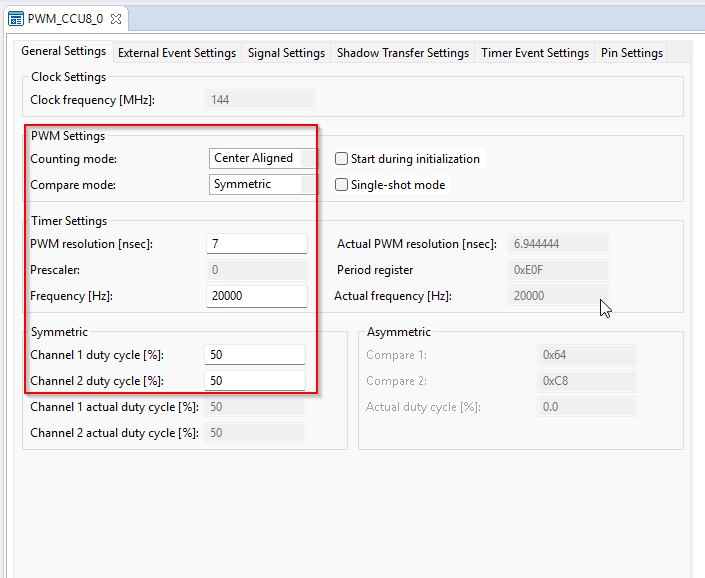
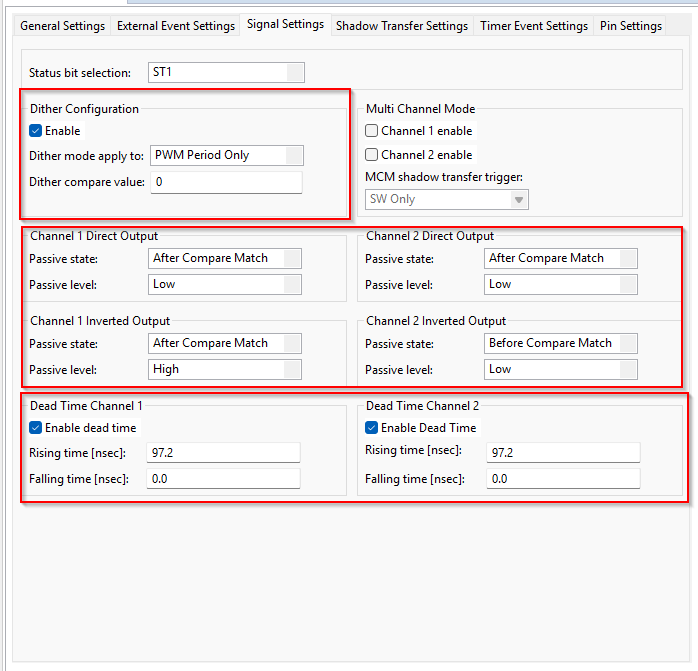
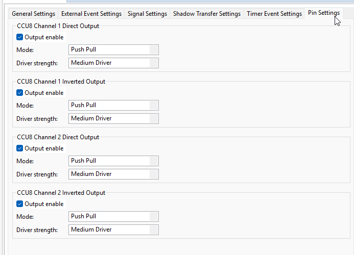
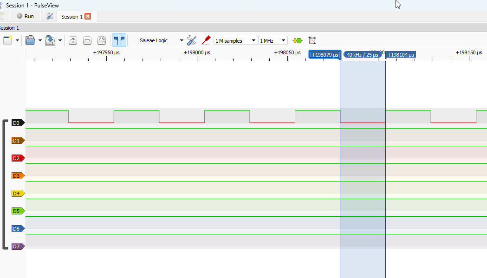
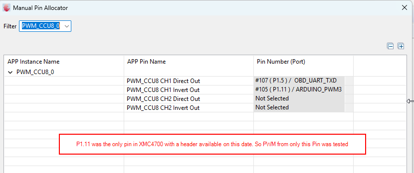

# Session 15-04-2026: CCU8 PWM Configuration & Dead Time Setup

**Date:** 15-04-2026  
**Focus:** XMC4700 CCU8 PWM module configuration for 20 kHz PMSM motor control  
**Status:** ✅ Configuration complete, ready for firmware integration

---

## Session Overview

**Objective:** Configure XMC4700 CCU8 (Capture/Compare Unit 8) to generate 20 kHz 3-phase PWM signals with 100 nsec dead time for motor control.

**Hardware Resource:** XMC4700 has **3 PWM_CCU8 timer slices** (PWM_CCU8_0, PWM_CCU8_1, PWM_CCU8_2), each capable of generating **4 independent PWM outputs** (2 complementary pairs). This session configured PWM_CCU8_0 for 3-phase motor control.

  
*Figure: DAVE PWM_CCU8 APP selection showing 3 available timer slices for PWM generation.*

**Key Achievement:** Established correct DAVE IDE CCU8 configuration with:
- ✅ 20 kHz PWM frequency (not 1 Hz)
- ✅ 97.2 nsec hardware dead time (14 counts)
- ✅ Complementary output pairs with opposite passive states (shoot-through protection)
- ✅ All 4 PWM outputs enabled (high-side + low-side for each phase)

---

## Work Completed Today

### CCU8 Configuration (CORRECTED)

**General Settings Tab:**
```
Clock Frequency:     144 MHz (XMC4700 peripheral clock)
Counting Mode:       Center Aligned (symmetric PWM)
Compare Mode:        Symmetric (3-phase balanced)
Frequency:           20000 Hz ← SET THIS (DAVE auto-calculates others)
Prescaler:           1 (auto-calculated from frequency)
Period Register:     7200 counts (hex 0x1C20, auto-calculated)
Actual Frequency:    20000 Hz ✓
PWM Resolution:      6.94 nsec (1 / 144 MHz)
```

  
*Figure: DAVE PWM_CCU8 General Settings tab showing 20 kHz configuration with center-aligned counting mode.*

**Signal Settings Tab — Dead Time & Output Configuration:**

Dead Time (Hardware-based):
- Channel 1 dead time: 14 counts (97.2 ns rising edge delay)
- Channel 2 dead time: 14 counts (97.2 ns rising edge delay)

Complementary Output Passive States (shoot-through protection):
- Channel 1 Direct: Passive = "Before Compare Match"
- Channel 1 Inverted: Passive = "After Compare Match" ← OPPOSITE to Direct
- Channel 2 Direct: Passive = "After Compare Match"
- Channel 2 Inverted: Passive = "Before Compare Match" ← OPPOSITE to Direct

  
*Figure: DAVE PWM_CCU8 Signal Settings tab showing dead time (14 counts) and complementary passive state configuration.*

**Pin Settings Tab — Output Enable (CRITICAL):**
- ✅ Channel 1 Direct Output: ENABLED
- ✅ Channel 1 Inverted Output: ENABLED
- ✅ Channel 2 Direct Output: ENABLED
- ✅ Channel 2 Inverted Output: ENABLED

  
*Figure: DAVE PWM_CCU8 Pin Settings tab showing all 4 outputs enabled (push-pull mode).*

**Shadow Transfer Settings:**
All registers (Period, Compare 1/2, Passive Level, Dither) set to Automatic Shadow Transfer at Period Match
→ No mid-cycle duty transients, synchronized updates

---

## Configuration Summary Table

| Parameter | Previous (Wrong) | Corrected | Rationale |
|-----------|------------------|-----------|-----------|
| **Prescaler** | 15 | 1 | Enables 20 kHz frequency |
| **Period Register** | 0x726 (1830 dec) | 0x1C20 (7200 dec) | 144 MHz ÷ 7200 = 20 kHz |
| **Frequency** | 1 Hz | 20000 Hz | Motor control loop rate |
| **Dead Time** | 0.0 nsec | 97.2 nsec | Shoot-through protection |
| **Ch1 Inverted Passive** | "Before Compare Match" | "After Compare Match" | Opposite to Direct (complementary pair) |
| **Ch2 Inverted Passive** | "After Compare Match" | "Before Compare Match" | Opposite to Direct (complementary pair) |
| **Output Enable (all 4)** | Unchecked | Checked | PWM must reach motor driver pins |

---

---

## Verification & Hardware Test Results

**PWM Output Verification (Oscilloscope - PulseView):**

  
*Figure: PulseView capture of 20 kHz PWM output on P1.11. Frequency and time period measurements are approximate (cursors do not snap to waveform). Single PWM output shown (dead time not visible with single channel).*

  
*Figure: PulseView capture showing PWM halftime visible. Verifies center-aligned PWM generation active at 20 kHz.*

**Test Summary:**
- ✅ PWM frequency confirmed: **20 kHz** (approximate, from scope measurement)
- ✅ Center-aligned PWM: **Halftime visible** (duty cycle midpoint observed)
- ⚠️ Dead time: **Not measurable** with single PWM channel (requires complementary pair capture)
- ⚠️ Pin limitation: **Only P1.11** available on XMC board for testing

**Next Verification Step:** Capture both complementary outputs (high + low side) simultaneously to measure dead time independently.

---

### Frequency Calculation

DAVE auto-calculates from frequency input:
```
User input: Frequency = 20000 Hz
DAVE calculates:
  Period = 144 MHz / 20000 Hz = 7200 counts
  Prescaler = 0
  Result: Actual Frequency = 20 kHz ✓
```

### Dead Time Hardware Implementation

Dead time prevents shoot-through in bridge legs (both high and low switches ON simultaneously):

```
Dead Time [ns] = DTR_count × (1 / 144 MHz)
Target: 100 ns
DTR_count = 100 ns / 6.94 ns = 14.4 ≈ 14 counts
Actual: 14 × 6.94 = 97.2 ns ✓
```

Implemented as hardware delayed rising edge on both channels (standard SR FlipFlop reconstruction):
- Rising edge: delayed by 14 counts
- Falling edge: original (no delay)

### Complementary Output Pairs (Shoot-Through Protection)

3-phase motor requires 6 PWM outputs (3 high-side + 3 low-side) in complementary pairs:

```
Phase U: [Ch1 Direct (high)] + [Ch1 Inverted (low)]
  → Ch1 Direct passive=Before, Ch1 Inverted passive=After ← OPPOSITE

Phase V: [Ch2 Direct (high)] + [Ch2 Inverted (low)]
  → Ch2 Direct passive=After, Ch2 Inverted passive=Before ← OPPOSITE
```

Opposite passive states ensure one switch always OFF during transition (dead time active).

---

## Deliverables

| Item | Status | Location |
|------|--------|----------|
| CCU8 DAVE configuration | ✅ Complete | DAVE project (this session notes parameters) |
| Hardware dead time setup | ✅ 97.2 ns (14 counts) | CCU8 Signal tab |
| Complementary output config | ✅ Shoot-through protected | Signal + Pin tabs |
| All 4 PWM outputs enabled | ✅ High/Low pairs active | Pin tab "Output enable" checked |
| Pin assignment (ready for next) | ⚠️ Pending | P1.0/1.1 (U), P1.4/1.5 (V), P1.8/1.9 (W) |

---

## Verification Checklist

Before importing generated code into firmware:

- [ ] General Tab: Frequency displays **20000 Hz**
- [ ] General Tab: Prescaler = **1**, Period = **7200** (hex 0x1C20)
- [ ] Signal Tab: Ch1 dead time = **14 counts (~97.2 ns)**
- [ ] Signal Tab: Ch2 dead time = **14 counts (~97.2 ns)**
- [ ] Signal Tab: Ch1 Inverted passive = **"After Compare Match"**
- [ ] Signal Tab: Ch2 Inverted passive = **"Before Compare Match"**
- [ ] Pin Tab: **All 4 outputs (Direct Ch1, Inverted Ch1, Direct Ch2, Inverted Ch2) have "Output enable" CHECKED**
- [ ] Shadow Transfer: Automatic at Period Match for all registers

---

## Next Steps

1. **Generate code** from corrected DAVE project
2. **Assign physical pins** to motor phase outputs (P1.0–P1.1, P1.4–P1.5, P1.8–P1.9)
3. **Firmware integration:** FOC algorithm reads encoder angle, calculates duty cycle, writes to CCU8 Compare registers
4. **Oscilloscope verification:** 20 kHz frequency, complementary dead time visible, no glitches

**Manual Pin Allocation:**

  
*Figure: DAVE manual pin allocation showing PWM output connections. **Note:** Only P1.11 header was available on XMC4700 board for hardware testing today. Future: All 3 phases (6 outputs) will be routed to motor driver.*

**Test Status (Today - 15-04-2026):**
- Only **P1.11** tested on XMC board (available header pin)
- 20 kHz PWM confirmed
- Future: Full 3-phase PWM output to motor driver when all pins are available

---

## Code Template: PWM Initialization & Control

**main.c — Basic PWM startup and duty cycle management:**

```c
#include "DAVE.h"

// PWM update variables
uint32_t duty_cycle_value = 3600;  // 50% of 7200 period (from DAVE calc)

int main(void) {
    // Initialize DAVE - this sets up the PWM with your configuration
    if (DAVE_Init() != DAVE_STATUS_SUCCESS) {
        while(1);  // Halt if init fails
    }

    // Start PWM - outputs begin running at 20 kHz
    // P1.5 (CH1 Direct):  50% duty at 20 kHz
    // P1.11 (CH1 Invert): Complementary with 97.2 ns dead time
    PWM_CCU8_Start(&PWM_CCU8_0);
    
    // Main loop - PWM runs autonomously in hardware
    while(1) {
        // PWM is free-running at 20 kHz
        // You can update duty cycle here if needed:

        // Example: sweep duty cycle 0% → 100% → 0%
        // duty_cycle_value += 100;
        // if (duty_cycle_value > 7200) duty_cycle_value = 0;
        // PWMSP_CCU8_SetDutyCycle(&PWM_CCU8_0, duty_cycle_value);

        // For now, just keep 50% (3600) running
    }

    return 0;
}
```

**Key Points:**
- `DAVE_Init()` initializes all DAVE apps (PWM_CCU8 configured as per DAVE settings)
- `PWM_CCU8_Start()` activates the PWM output (20 kHz free-running)
- `PWM_CCU8_SetDutyCycle()` updates compare registers at runtime (for FOC algorithm)
- Duty cycle range: `0` (0%) to `7200` (100%) → matches period register

**For FOC Integration:**
Replace the main loop with:
```c
while(1) {
    encoder_angle = read_encoder();  // From CCU4 capture (session 12-04)
    foc_duty = compute_foc_algorithm(encoder_angle);  // FOC controller
    PWM_CCU8_SetDutyCycle(&PWM_CCU8_0, foc_duty);  // Update PWM
}
```

---

✅ **CCU8 PWM configuration finalized**

Motor driver ready to receive 20 kHz 3-phase PWM with hardware dead time protection. Hardware commissioning (Step 5 from session_11-04-2026) can proceed once firmware reads encoder and commutates phases.
