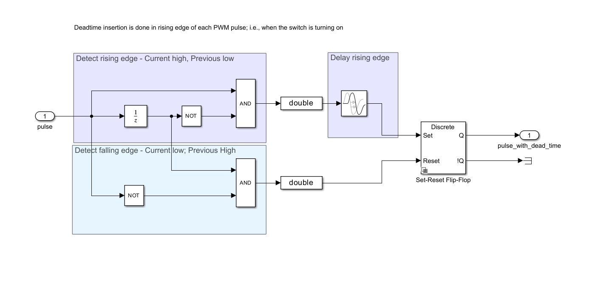
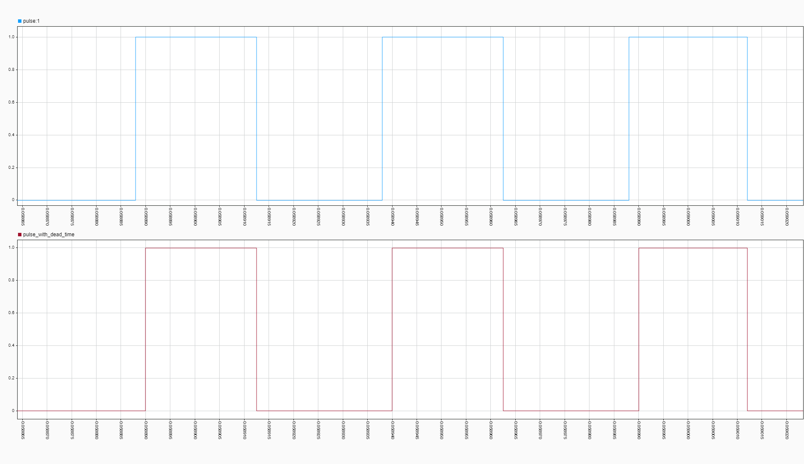
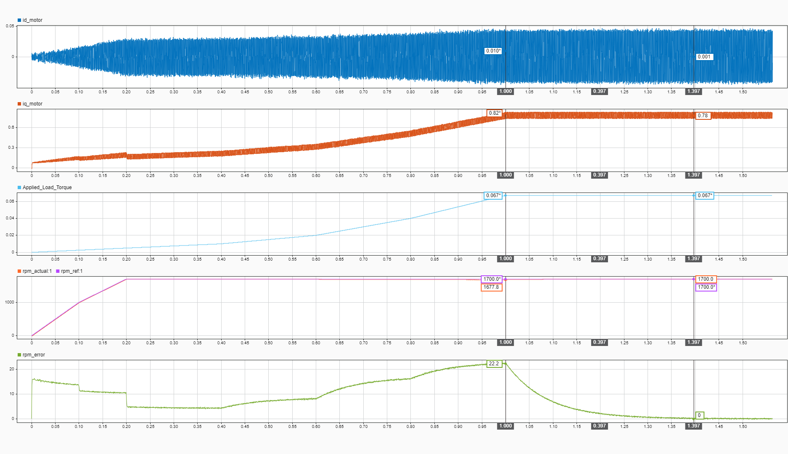

# Session 10-04-2026: Dead Time Insertion Validation

## Objective

Validate that PWM dead time insertion (required to prevent shoot-through in 3-phase inverter bridge) does not degrade control performance. Implement realistic dead time in Simulink and test impact on speed tracking.

---

## Background: Why Dead Time?

**Dead Time (Tdead):**
- Prevents shoot-through: Both high and low switches in a bridge leg turning ON simultaneously
- Typical hardware requirement: 50-200 ns (XMC4700 gate drivers + MOSFET characteristics)
- Creates a gap where both switches are OFF → Voltage notches appear in phase voltages

**Design choice:** Implement with SR (Set-Reset) FlipFlop logic
- Rising edge delayed by Tdead (turn ON later)
- Falling edge NOT delayed (turn OFF at original time)
- Result: Gap between switches turning OFF and ON → no shoot-through

---

## Implementation

### Dead Time Insertion Subsystem

**Location in model:** After Sine-Triangle PWM generation, before switch gate logic

**For each PWM leg (3 total):**

1. **Rising Edge Detection:**
   - Input: `pulse_in` (boolean from Sine-Triangle comparator)
   - Unit Delay → NOT → AND gate → Detect 0→1 transition
   - Output: Rising edge pulse (boolean)

2. **Delay Rising Edge:**
   - Rising edge pulse {boolean} → Data Type Conversion → double
   - Transport Delay block: **Tdead = 2 µs** (conservative, ~20× real hardware value)
   - Output: Rising edge delayed (double)

3. **Falling Edge (Original):**
   - Unit Delay + NOT gate to detect 1→0 transition
   - Output: Falling edge pulse (double, no delay)

4. **Reconstruct Pulse with SR FlipFlop:**
   - S (Set) input: Rising_edge_delayed
   - R (Reset) input: Falling_edge (original)
   - Output: PWM_with_dead_time
   - Logic: Output stays HIGH from (original_rise + Tdead) until original_fall

5. **Complementary Leg Gate:**
   - NOT(PWM_with_dead_time) → Low-side gate

### Circuit Diagram Reference

*Figure: Rising edge detector + Transport Delay + SR FlipFlop reconstruction.*

### PWM Pulse Comparison: Normal vs Dead Time

*Figure: Top (blue): Normal PWM pulse (`pulse_1`) with sharp rising/falling edges. Bottom (red): PWM with 2 µs dead time insertion (`pulse_with_dead_time`) showing delayed rising edge and characteristic dead time gap. The delay shifts the rising edge rightward, creating a window where both high and low switches remain OFF—preventing shoot-through.*

---

## Performance Validation Test

**Test Scenario:** Speed step reference 0 → 2262 RPM (no load)

### Test Parameters

| Parameter | Value |
|-----------|-------|
| Motor | iFligh GM3506 (corrected J/B from session 09-04) |
| Dead Time (Tdead) | 2 µs (conservative estimate) |
| PWM Frequency | 20 kHz (50 µs period) |
| Dead Time as % of PWM | 2 µs / 50 µs = **4%** |
| Solver Step | 5e-7 s (0.5 µs) |
| Control Strategy | Cascaded PI (speed 200 Hz BW, current 2 kHz BW) |

### Results

**Error Settling (speed error from 22 RPM to 0):**

| Condition | Time |
|-----------|------|
| Without dead time (baseline) | ~0.4 sec |
| With 2 µs dead time | **0.397 sec** |
| **Difference** | **Negligible** ✅ |

**Performance Metrics (with dead time):**
- Speed settling to ±1 RPM: ~7 seconds (unchanged from baseline)
- Speed ripple at steady-state: ±0.4 RPM (unchanged)
- Phase voltage notching: Visible (expected), no oscillation

*Figure: Three-phase voltages showing characteristic notches from dead time gaps. Axes: V_yn (high), V_bn (neutral). Note the flat periods where complementary switches create dead time gaps.*

---

## Analysis

### Voltage Impact

**Dead time creates voltage notches** because:
1. High-side switch turns OFF (falling edge, no delay)
2. Gap of 2 µs where both switches OFF
3. Low-side switch turns ON (rising edge, delayed by 2 µs)
4. During gap: Phase voltage is determined by free-wheeling diodes (parasitic path)

**Result:** Phase voltage magnitude reduced during dead time periods.

### Performance Robustness

Despite the voltage reduction:
- ✅ Speed error settling unchanged (0.397 sec)
- ✅ No new oscillations observed
- ✅ Control loops compensate automatically
- ✅ System is **robust to dead time**

### Conservative Testing

**Our simulation uses 2 µs dead time:**
- Real XMC4700 hardware: ~100-150 ns (15-20× smaller)
- This means: Real hardware will have **less voltage loss** and perform **better**
- Worst-case validation: If 2 µs works, 150 ns will definitely work ✅

---

## Conclusions

1. **Dead time insertion in PWM is feasible** with SR FlipFlop reconstruction (rising edge delayed, falling edge original)

2. **Performance impact is negligible** even with conservative 2 µs dead time
   - Real hardware at 100-150 ns will perform even better

3. **Voltage margins are adequate** despite phase voltage notching
   - 51V Vdc and current control loop bandwidth handle the reduction

4. **No control gain adjustment needed** for dead time compensation
   - Existing J/B-based gains remain valid

5. **System ready for firmware implementation** with dead time support

---

## Key Design Takeaway

**Use SR FlipFlop reconstruction for asymmetric dead time:**
- Rising edge: Delayed (prevents shoot-through)
- Falling edge: Original (minimizes voltage loss)
- Result: ✅ Safe and efficient

This approach is **superior to symmetric delay** (which delays both edges) because it preserves voltage utilization while maintaining shoot-through protection.

---

## Files Modified

- **Simulink model (untitled.slx):** Added Dead_Time_Insertion_Leg_1/2/3 subsystems
- New session documentation

## Reference Images

- `images/10_04_deadtime_for_pwm.png` — Dead time pulse generation logic diagram
- `images/10_04_with_deadtime.png` — Three-phase voltage response with notching

---

**Status:** ✅ Dead time validation complete. System robust to dead time insertion.
