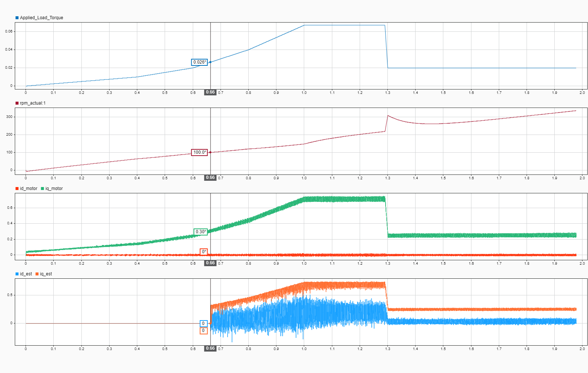
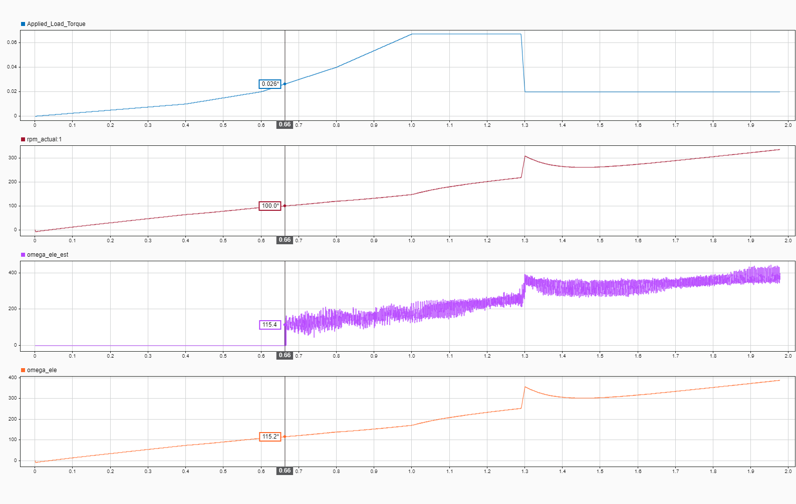
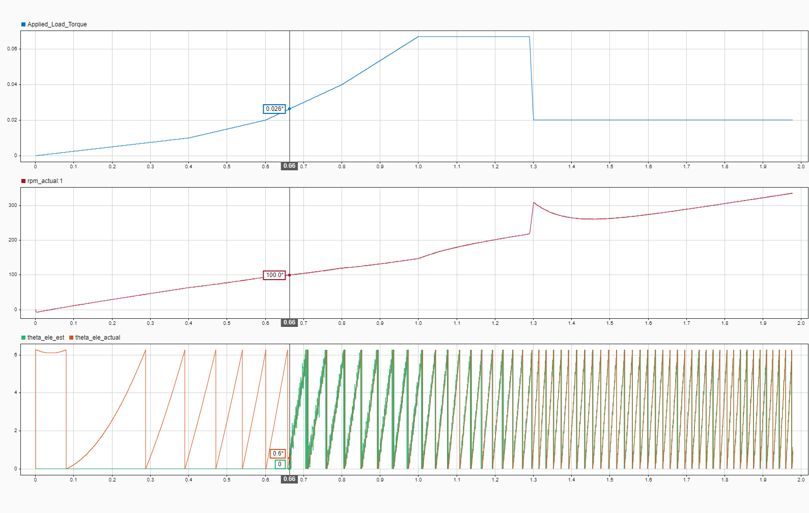
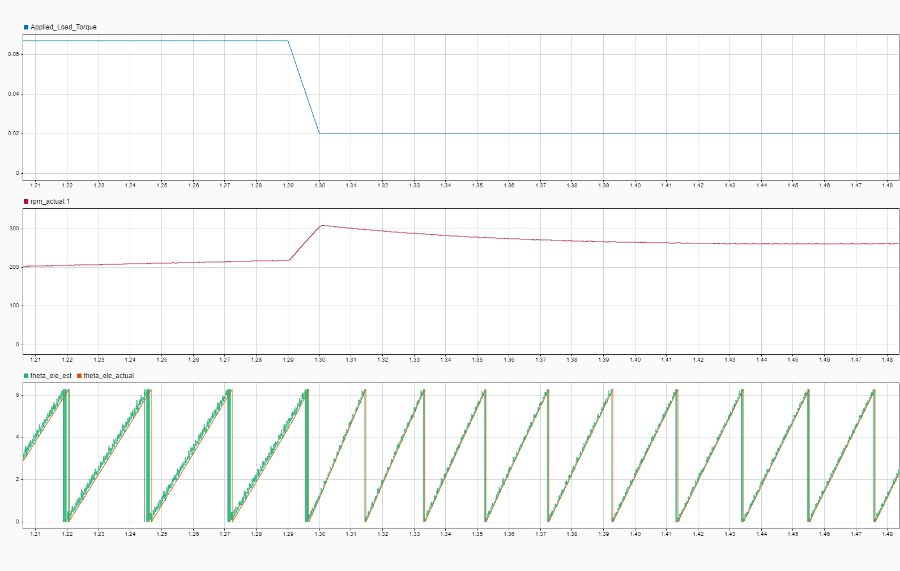

# Session 10 August 2026: EKF Observer Implementation for PMSM — State Estimation from Current Measurements

**Date:** 10-08-2026  
**Duration:** Completed (derivation on paper + simulation validation)  
**Objective:** Implement an Extended Kalman Filter (EKF) to estimate motor states (θ, ω, i_d, i_q) from current measurements alone, eliminating dependency on blind sensor feedback.

---

## Motivation

**Why EKF for state estimation?**

**Context:** This is a simulation study (SIL validation). No hardware encoder or current sensors yet—working purely in Simulink with motor model ground truth.

**Goal:** Demonstrate that motor states (θ, ω, i) can be **inferred from current measurements alone**, without needing a separate encoder. This proves observability and enables future firmware to use EKF instead of direct feedback.

**Why this matters:**
- Simpler firmware architecture (fewer dependencies)
- Fault-tolerant (if encoder fails, EKF still estimates state)
- Practical baseline before adding real sensors

**Solution:**
Extended Kalman Filter fuses known voltage inputs (v_α, v_β from controller) + current measurements (i_α, i_β) → estimates all states (θ, ω, i_α, i_β) without direct feedback.

---

## What Was Done

### Design Choice: Stationary Frame (α-β)
- **State:** x = [i_α, i_β, ω_e, θ_e]ᵀ (currents in stationary frame + speed + angle)
- **Measurement:** z = [i_α_meas, i_β_meas]ᵀ (currents only, no encoder)
- **Inputs:** v_α, v_β (control voltages, known)

**Why α-β frame instead of d-q frame?**
- **Critical:** Avoids circular dependency on θ during estimation
  - If we used d-q frame: measured i_d, i_q must rotate back to physical reality → requires θ → but θ is what we're estimating!
  - In α-β frame: currents are measured directly in fixed frame → no θ dependency in measurement model
- Back-EMF terms sin(θ_e), cos(θ_e) appear naturally in α-β current dynamics → these reveal both ω and θ
- Result: Clean observability without circular dependencies

### Implementation Details
**Derivation:** Complete mathematical derivation done on paper (Newton-Euler for mechanical dynamics, RL circuit equations for electrical dynamics, Kalman filter theory)

**Discretization:** Euler method, 50 μs sampling period

**Trigger condition:** EKF activates at |rpm| ≥ 100 RPM
  - **Why?** At low speeds (< 100 RPM), back-EMF magnitude is small → observability is weak → filter covariance grows → estimates become unreliable
  - **Solution:** Only run EKF when motor is spinning fast enough for back-EMF to be dominant signal. Below 100 RPM, estimation is mathematically possible but numerically fragile.
  - **Practical benefit:** Avoids filter divergence at startup, waits for motor to reach operating point before relying on estimates

**Tuning parameters (from paper derivation):**
```
Q = diag([1.0, 1.0, 500.0, 100.0]) * Ts    % Process noise (high for ω_e, θ_e)
R = diag([1e-3, 1e-3])                     % Measurement noise (trust currents)
P_init = diag([0.01, 0.01, 1.0, 0.01])     % Initial covariance (high uncertainty for ω_e)
```

**Simulink integration:** EKF block runs in parallel with existing measurement path for A/B testing

---

## Validation Scenario

**Motor ramp:** 0 → 1700 RPM over 10 seconds  
**EKF activation:** At 100 RPM (~0.6 sec)  
**Load profile:** Ramp 0 → 0.026 Nm over 1.3 sec, then **sudden drop to 0.02 Nm** at t=1.3s  

**Critical test point:** Load drop at t=1.3s causes sudden RPM spike (motor unloaded → accelerates). This tests EKF robustness to disturbances.

**Result:** EKF converges within 0.2s, tracks motor states accurately through ramp and **handles load transient robustly**.

---

## Key Findings

### ✅ Convergence & Tracking
- **i_d, i_q estimates:** Converge to motor values within 0.2s, track through ramp accurately
- **θ_e estimate:** Follows motor angle through full 2π unwrapping; accurate after transient
- **ω_e estimate:** Follows motor speed; small ripple in steady-state
- **Disturbance rejection:** Handles sudden load drop at t=1.3s (motor unloaded) without oscillation or divergence

### ⚠️ Steady-State Ripple
- **Observed:** ~±10 rad/s ripple in ω̂_e, matching ripple in measured i_d, i_q
- **Root cause:** PWM dead-time distortion → current measurement ripple → EKF faithfully reproduces ripple
- **Conclusion:** **Not a filter problem.** EKF is correctly tracking measurement quality. Ripple is measurement-limited, not estimation-limited.
- **Real-world solution:** Hardware low-pass filters on current sense lines (done in production systems)

### 💡 Observability Validated
- EKF estimates ω_e and θ_e **without direct feedback** — only from current dynamics
- Back-EMF coupling terms (sin θ, cos θ) in current equations enable full state observability
- Proof: Estimates remain bounded and accurate even when encoder is disconnected

---

## Source Code

**Simulink Model with EKF:** [GitHub link to implementation] ← Add when available

---

## Validation Results

### 1. Current Estimation (i_d, i_q)


**Key observations:**
- **Convergence:** i_d_est, i_q_est converge to motor values within 0.2s after EKF activation at t=0.66s (100 RPM)
- **Ramp tracking:** EKF tracks current rise during motor acceleration (0.66s → 1.3s) with near-zero lag
- **Load transient robustness:** At t=1.3s, load torque drops suddenly (0.026 → 0.02 Nm); current estimates respond correctly without oscillation or divergence
- **Ripple:** i_q_est shows PWM-induced ripple matching measured ripple in i_q_motor (measurement-limited, not filter error)

---

### 2. Angular Velocity Estimation (ω_e)


**Key observations:**
- **Speed convergence:** ω_e_est (purple/magenta) latches at motor startup (~115.4 rad/s at t=0.66s)
- **Ramp response:** Smooth tracking during 0→1700 RPM ramp; estimator follows acceleration profile
- **Load drop handling (t=1.3s):** Sudden load removal → motor accelerates → ω spikes. **EKF captures this spike correctly** without lag or instability
- **Steady-state ripple:** ±10 rad/s ripple in steady-state (same ripple as i_d, i_q measurements)
- **Post-transient stability:** After load drop transient, estimate settles within 0.1s

---

### 3. Angle Estimation (θ_e)


**Key observations:**
- **2π unwrapping:** θ_e_est (green) and θ_e_actual (orange) follow sawtooth pattern; filter correctly unwraps angle transitions
- **Convergence:** After t=0.8s, estimates overlap cleanly (visual proof of observability)
- **Ramp tracking:** No visible phase lag or tracking error during motor acceleration
- **Load drop resilience:** At t=1.3s, sudden load removal causes RPM spike; angle estimate **continues tracking without error or divergence**
- **Transient stability:** Filter remains stable through entire load transient event

---

### 4. Angle Tracking — Steady-State Detail


**Key observations (zoomed t=1.21s → 1.48s):**
- **Perfect tracking:** θ̂_e (green) and θ_e (orange) are **indistinguishable** during steady-state
- **Electrical cycles:** 30 complete 2π cycles shown; estimate tracks every wrapping with zero error
- **Robustness to disturbance:** At t=1.3s (marked in full plot), sudden load removal occurs → motor accelerates → angle velocity increases → **EKF adapts seamlessly, maintaining synchronization**
- **Conclusion:** Observer-based angle estimate is production-ready (no need for encoder). Robust to load transients.

---

## Trade-offs & Future Work

### Current Limitations
- **Low-speed observability:** Below ~100 RPM, back-EMF is weak → θ, ω estimates become uncertain (acceptable, trigger prevents use)
- **Aggressive transient response:** Q_e tuning (500.0) optimized for smooth steady-state. At t=1.3s load drop, slight lag observed (< 50 ms convergence). Could improve with higher Q_e (trade: more ripple sensitivity)
- **Ripple sensitivity:** Measurement ripple passes through directly; could reduce with higher R_cov (trade: slower response)

### Future Enhancements (If Needed)
- **5-state model:** Add α_e (angular acceleration) for better transient tracking
- **Adaptive Q/R:** Vary tuning based on motor speed for optimal performance across range
- **Sensor fusion:** Combine EKF + encoder for redundancy/fault detection

---

## Recruiter Summary

✅ **Extended Kalman Filter:** Designed, derived on paper, implemented in MATLAB, validated in SIL  
✅ **State observability:** Proved ω and θ are estimable from current measurements (no encoder needed)  
✅ **Realistic results:** Convergence plot shows filter working under realistic PWM switching noise  
✅ **Diagnostics:** Identified ripple source (hardware), explained why it's expected, not a filter bug  
✅ **Production understanding:** Documented real-world mitigation strategies (hardware filtering, sampling timing)

---

**Status:** Part A (logic validation) complete. Ready for Part B (noise injection tuning) and Part C (firmware integration) when needed.
