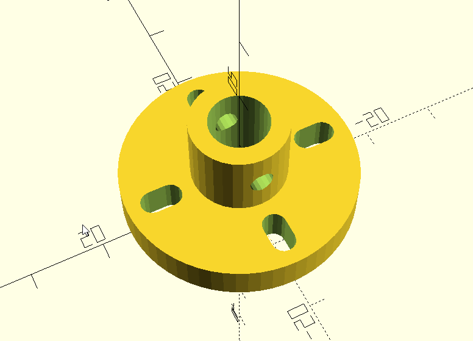
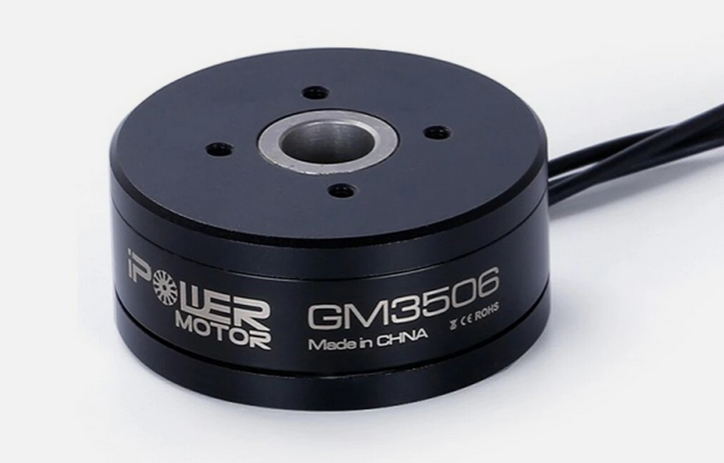

# Session 11-04-2026: Custom 3D Flange Design for Shaft Mounting

## Objective

Design a custom 3D-printable flange to mechanically couple the GM3506 gimbal motor's hollow shaft to an 8mm steel output shaft. This is the mechanical foundation for inverted pendulum rod mounting (future phase).

---

## Problem Statement

**Off-the-shelf solutions didn't exist:**
- Motor flange: 4 mounting holes at ~20mm PCD (estimated from photos)
- Standard flanges available: Only with 24mm PCD (too wide spacing)
- Shaft requirement: 8mm bore, M3 grub screw clamping

**Solution:** Design parametric, 3D-printable flange in OpenSCAD

---

## Design Overview

### Motor → Flange → Steel Shaft Assembly

```
iFligh GM3506 Motor
   ↓ (12mm OD hollow shaft)
   ↓
3D-Printed Flange (PETG)
   • Bolts to motor's 4 flange holes (M3 slotted for tolerance)
   • Center bore: 8mm (hollow shaft passage)
   • Grub screw clamp: Radial M3 through boss
   ↓ (8mm bore)
   ↓
8mm Steel Output Shaft
   (Later: IP rod bolts to far end)
```

---

## Design Parameters

| Parameter | Value | Notes |
|-----------|-------|-------|
| **Inner Diameter (ID)** | 8 mm | Design bore; motor shaft hollow ID = 8.6 mm → 8 mm bore with ~0.3 mm clearance per side |
| **Pitch Circle Diameter (PCD)** | 20 mm | Motor flange hole spacing |
| **Mounting Holes** | 4 × M3 | Slotted for ±1mm adjustment |
| **Flange Outer Diameter** | 32 mm | Proportional to ID |
| **Flange Thickness** | 5 mm | Adequate for rigidity |
| **Center Boss Height** | 10 mm | Houses grub screw |
| **Grub Screw** | M3 | Radial clamping through boss sidewall |
| **Material** | PETG | Better rigidity than PLA, easier than resin |

---

## Key Design Features

### 1. Slotted Radial Holes (Tolerance Solution)

```openscad
// Radial slot: 2.5mm radial length
// Covers 19-21mm PCD range (±1mm adjustment)
hull() {
    cylinder(h = flange_thickness + 1, r = screw_radius, $fn = 16);
    translate([2.5, 0, 0])
    cylinder(h = flange_thickness + 1, r = screw_radius, $fn = 16);
}
```

**Why radial slots?**
- Manufacturing tolerance stack-up on motor flange holes
- Easy on-site PCD adjustment (19-21mm range)
- No over-constraint during assembly
- M3 clearance holes allow bolt flexibility

### 2. Center Boss + Grub Screw Clamping

```openscad
// Radial grub screw hole (M3) at mid-height
translate([0, 0, boss_height / 2])
rotate([0, 90, 0])
cylinder(h = boss_radius * 2 + 2, r = grub_screw_radius, center = true, $fn = 16);
```

**Advantages:**
- **No shaft bending moment** (pure radial clamping)
- **Friction-based hold:** M3 grub screw (0.5–1.0 N·m typical) provides ~50-100 N clamping force
- **Adequate for low-speed torque:** At 2262 RPM max, friction holds easily
- **Adjustable:** Can re-tighten/loosen as needed

### 3. Parametric Design (OpenSCAD)

All critical dimensions at top of file—easy customization:
```openscad
id = 8;              // Inner diameter → change for different shafts
pcd = 20;            // PCD → change for different motor flanges
screw_dia = 3.2;     // M3 clearance → change for M2.5 (2.7mm) or M4 (4.2mm)
```

Full geometry adapts when parameters change.

---

## 3D Printability

**Print Orientation:** Flat (flange_thickness vertical)
- **Layer height:** 0.2 mm (standard)
- **Print time:** ~1–2 hours on typical FDM printer
- **Support:** Required under/between mounting holes
- **Material cost:** ~$2–5 in PETG

**Strength estimate at 2000 RPM:**
- Grub screw friction: ~50 N (radial)
- Motor max torque: 600–1000 g·cm = 0.06–0.1 N·m
- Safety margin: Excellent for gimbal/IP application

---

## Design Files

**Location:** `universal_flange.scad`

**To Use:**
1. Download OpenSCAD (free, all platforms)
2. Open `universal_flange.scad` in OpenSCAD
3. Modify parameters at top if needed
4. **Export → STL**
5. Slice for PETG (Cura, PrusaSlicer, etc.)
6. Print

**Render (screenshot):** 


*Figure: Parametric flange design showing center boss, slotted mounting holes (radial for ±1mm PCD tolerance), and 8mm hollow bore.*

**Motor shaft reference:**


*Figure: GM3506 gimbal motor with hollow 12mm OD shaft (ID 8.6mm). Flange bolts to 4 flange holes visible on motor top face.*

---


### Flange Fabrication & Verification

1. Export `universal_flange.scad` → STL
2. Print in PETG
3. Test fit on motor (M3 bolts, 8mm shaft, grub screw function)
4. Document clearances + adjustments needed

---

## Mechanical Verification

**Static strength check:**

Motor max torque: 1000 g·cm = 100 mN·m = 0.1 N·m

Grub screw friction:
- M3 typical clamp torque: 0.5–1.0 N·m
- Friction coefficient (steel-PETG): ~0.4
- Clamp force: ~50–100 N (radial)
- Friction torque: F × r = 50 N × 0.004 m = **0.2 N·m** ✅

**Result:** Grub screw friction hold is > 2× minimum required torque. Safe margin.

---

## Design Philosophy

This design demonstrates **constraint-driven engineering:**

1. **Problem:** No catalog flange for this PCD/bore combo
2. **Solution:** Parametric CAD + 3D printing (maker approach)
3. **Robustness:** Slotted holes tolerate real-world variations
4. **Simplicity:** Grub screw clamping, no over-design
5. **Iteration:** Easy to print, test, modify parameters, reprint

---

## Next Steps (Flange)

- [ ] Export to STL
- [ ] Print in PETG + test fit on motor (verify bolt access, grub screw alignment)
- [ ] Document clearances + any adjustments

---

## Notes (Flange)

- Flange design independent of motor control (mechanical + software decoupled)
- PETG print serves as both prototype and functional part (low stress application)
- Grub screw approach is reversible—can adjust/re-clamp at any time
- Design is scalable: Change `id`, `pcd`, `screw_dia` for other motor+shaft combos

---

---

# Inverted Pendulum (IP) Dynamics Architecture

## Problem Definition

**Goal:** Use motor to balance an inverted pendulum rod hanging from motor shaft.

**Requirements:**
- Rod swings freely around pivot (not rigidly clamped)
- Motor applies torque through pivot to control swing
- Real pendulum dynamics (gravity + motor torque interaction)
- Active control needed (not passive friction damping)

---

## IP Mechanical Architecture

```
8mm Steel Shaft (from motor via flange)
  ↓
Pivot Point (frictionless: ball bearing or smooth pin)
  ↓
IP Rod (hollow tube, 250mm length, mass ~100g)
  • Rod hangs vertically under gravity
  • Swings freely from pivot
  • Motor torque controls swing angle via bearing
```

**Key difference from flange:** Rod is **NOT rigidly fixed** — it rotates freely around motor shaft axis.

---

## Pivot Design Decision: Frictionless + Active Damping

**Why frictionless?**
- Represents real pendulum physics
- Allows observer-based estimation (future IMU + sensorless)
- More calculatable than friction-based damping

**Control approach:**
```
τ_command = K_p × (θ_ref - θ) + K_d × (-ω_rod)
  where:
    θ_ref = reference angle (e.g., 300° for upright)
    θ = rod angle (encoder feedback)
    ω_rod = rod angular velocity (derivative of θ)
    K_p, K_d = proportional & derivative gains
```

Motor applies **active damping torque** proportional to rod velocity to prevent overshoot.

---

## Rod Specification (Preliminary)

| Parameter | Value | Rationale |
|-----------|-------|-----------|
| **Length** | 250 mm | Practical control range, not unwieldy |
| **OD (Outer Diameter)** | 12 mm | Hollow, 2mm walls for PETG strength |
| **ID (Inner Diameter)** | 8 mm | Slides over shaft (same as flange bore) |
| **Material** | PETG (3D printed) | Easily customizable, good strength |
| **Estimated Mass** | 80–120 g | Overcome motor cogging, reasonable inertia |
| **Pivot Mechanism** | Pin or bearing at near end | Rod rotates freely around shaft |

---

## Dynamics Model

**Rod equation of motion:**
$$\alpha = \frac{\tau_{motor} - m \cdot g \cdot L_{CoM} \cdot \sin(\theta)}{I_{rod}}$$

Where:
- $\alpha$ = rod angular acceleration (rad/s²)
- $\tau_{motor}$ = motor torque output (N·m)
- $m$ = rod mass (kg)
- $g$ = gravity (9.81 m/s²)
- $L_{CoM}$ = distance from pivot to center of mass (m)
- $\theta$ = rod angle from vertical (rad; 0° up, 180° down)
- $I_{rod}$ = moment of inertia (kg·m²)

**Moment of inertia (hollow rod):**
$$I_{rod} = \frac{1}{12} m L^2 + m d_{CoM}^2$$

For uniform hollow rod, $d_{CoM} \approx L/2$ (center of mass at mid-length).

---

## Control Challenge: Motor Torque Budget

**Motor max torque:** 0.1 N·m (from PMSM specs)

**Rod holding torque (vertical):**
$$\tau_{gravity} = m \cdot g \cdot L_{CoM} = 0.1 \text{ kg} \times 10 \times 0.125 \text{ m} \approx 0.125 \text{ N·m}$$

**Analysis:** Gravity torque (0.125 N·m) > motor max torque (0.1 N·m) ⚠️

**Solution:** Reduce rod mass or move CoM closer to pivot:
- Lighter rod (60–80 g) → gravity torque ~0.075–0.100 N·m ✅
- OR shorter rod (200 mm) → CoM at 100 mm → gravity torque ~0.10 N·m (marginal)

**Conclusion:** Rod mass must be tuned so motor can actively hold it upright with margin for control bandwidth.

---

## Cogging Torque Check

**PMSM cogging torque:** ~5–15% of rated → ~5–15 mN·m

**Rod hanging freely (no motor):**
- At any angle, gravity dominates cogging
- Rod will naturally hang downward (will not stick in cogging detents)
- ✅ No issue for passive hanging

---

## Simulation Approach (Next Phase)

Once motor runs reliably:

1. **Add IP block to Simulink:**
   - Motor FOC output (Iq command)
   - Convert Iq → τ_motor using motor constant (K_t)
   - Integrate rod dynamics equation
   - Output: $\theta$ and $\omega$ to encoder emulator

2. **Design angle controller:**
   - PI loop: θ_ref → error → τ_command
   - Derivative damping: -K_d × ω_rod
   - Saturation: Limit τ_command to motor capability

3. **Validate scenarios:**
   - Swing-up: Motor accelerates rod from hanging down to vertical
   - Stabilization: Motor holds rod upright against gravity
   - Disturbance rejection: Motor counteracts external perturbations

4. **Tune gains** (K_p, K_d) based on simulation response

---

## Open Questions (Resolved Later)

- [ ] Exact rod CoM distribution (affects I_rod calculation)
- [ ] Pivot stiffness (ball bearing vs. pin tolerance)
- [ ] Encoder resolution (sufficient for angle measurement?)
- [ ] Full simulation validation before hardware assembly

---

## Sequence (Once Motor Running)

1. **Motor validates** (stable speed, encoder working)
2. **Add IP dynamics model** to Simulink with estimated rod parameters
3. **Simulate swing-up + stabilization** with cascaded control
4. **Design pivot coupling** (based on simulation requirements)
5. **3D print IP rod** with final geometry
6. **Assemble hardware:** Motor + flange + shaft + pivot + rod
7. **Real hardware validation:** Compare actual response to simulation

---

## Design Philosophy (IP)

Real inverted pendulum is a **nonlinear control challenge**:
- Gravity acts against motor at unstable equilibrium (upright)
- Requires active feedback to stabilize
- Dynamic controller (PI + damping) must counteract both gravity and overshoot
- Provides realistic testbed for observer-based estimation (future)

This is fundamentally different from simple position control—physics matters.

---

## Appendix: Hardware Commissioning Strategy (Original Plan)

*Note: The following section is the original hardware commissioning strategy drafted before this session. The actual work performed on 11-04-2026 followed part of this plan (mainly Step 3: Phase Identification via DC Test). Included here for reference and future use.*

# Session 11-04-2026: Hardware Commissioning Strategy for PMSM Motor Control

**Date:** 11-04-2026  
**Focus:** Detailed plan for hardware bring-up starting from encoder characterization through motor commutation  
**Status:** Strategy locked, ready for implementation

---

## Why This Strategy?

**Problem:** PMSM requires rotor angle (θ_electrical) for proper commutation. Without it, no FOC is possible.

**Solution:** Build motor control incrementally, each step verifiable:
1. Prove encoder hardware works
2. Establish electrical angle reference 
3. Identify phase sequence experimentally
4. Map commutation to validated rotor position
5. Enable PWM only when rotor angle is known

**Why incremental?** Each step is independently testable. No blind debugging.

---

## Detailed Commissioning Steps

### Step 1: Encoder Characterization

**Hardware Setup - AS5048A Encoder Wiring**

**Option A: PWM Output (Recommended for Step 1)**

Motor encoder AS5048A has three wires:
```
Red wire:   VCC (supply voltage, 3.3V or 5V)
Black wire: GND (ground)
White wire: PWM output (rotor angle encoded as PWM duty cycle)
```

XMC4700 connection:
```
Encoder Red   → XMC4700 VCC (3.3V recommended, check board specs)
Encoder Black → XMC4700 GND
Encoder White → XMC4700 P1.1 (GPIO input, configure as CCU4 capture)
```

DAVE app needed: **CCU4** (slice 3 recommended, Input Capture mode)

**Option B: SSI/SPI Output (For later, advanced)**

SPI rainbow cable (5 wires):
```
VCC (Red)    → 3.3V
GND (Black)  → GND
CLK (Yellow) → P5.8 (SPI clock)
MOSI (Green) → P5.9 (not used, tie low)
MISO (Blue)  → P5.10 (encoder data)
CS (Brown)   → P1.0 (chip select, GPIO output)
```

DAVE app needed: **USIC (SPI Master)** + **GPIO**

---

**Objective:** Verify AS5048A encoder outputs angle as shaft rotates. Establish mechanical → electrical conversion.

**Setup:**
- Motor unpowered (no PWM, no DC applied)
- XMC4700 reading encoder via SSI interface
- UART printing encoder values every 100ms

**Procedure:**
1. Rotate motor shaft by hand (slow, full 360° revolution)
2. Record encoder values as you rotate
3. Verify: min→max→min (0° → 360° → 0°) with smooth transition

**Expected Output:**
```
Encoder mechanical angle: 0.0° → 45.0° → 90.0° → ... → 360.0° → 0.0°
Change should be smooth, no jumps or reversals
```

**Why:** Confirms encoder is electrically connected correctly and AS5048A is responding.

**Documentation Required:**
- Mechanical angle range (should be 0° to 360°)
- No glitches or anomalies
- Encoder counts per revolution (14-bit = 16384 counts)

---

### Step 2: Electrical Angle Reference & Conversion Formula

**Objective:** Map mechanical angle → electrical angle using motor pole pairs.

**Theory:**
```
PMSM has 11 pole pairs (from motor datasheet)

Mechanical rotation: 0° → 360° (1 full revolution)

Electrical angles in that revolution: 11 complete cycles

Conversion: θ_electrical = (θ_mechanical) × 11

There are 11 positions per mechanical revolution where θ_e = 0°:
  θ_mechanical = 0°, 32.7°, 65.5°, 98.2°, ..., 327.3°
  θ_electrical = 0° at each
```

**Procedure:**
1. Rotate shaft slowly while watching encoder
2. Note the mechanical angle values where θ_e should cycle: 0° → 120° → 240° → 360° → (repeat)
3. These occur at: mech_angle = 0°, 32.7°, 65.5°, etc.

**Code Implementation:**
```c
// Choose ONE reference (any of the 11 electrical zeros)
const float THETA_E_ZERO_REF_MECH = 0.0;  // degrees, mechanical

// Calculate electrical angle
float theta_e = (encoder_mech_angle - THETA_E_ZERO_REF_MECH) * 11.0;

// Normalize to 0-360
while (theta_e < 0) theta_e += 360;
while (theta_e >= 360) theta_e -= 360;

printf("Mech: %.1f° → Elect: %.1f°\n", encoder_mech_angle, theta_e);
```

**Expected Output (with THETA_E_ZERO_REF_MECH = 0.0):**
```
Mech: 0.0° → Elect: 0.0°
Mech: 32.7° → Elect: 360.0° (or 0.0° after modulo)
Mech: 65.5° → Elect: 720.0° (or 0.0° after modulo)
...
```

**Documentation Required:**
- Confirmed: θ_electrical cycles 11 times per mechanical revolution
- Formula verified in code
- Chosen THETA_E_ZERO_REF_MECH value recorded

---

### Step 3: Phase Identification via DC Test

**Objective:** Determine which motor wires (Phase_A, Phase_B, Phase_C) produce smooth rotation.

**Setup:**
- Motor unpowered from XMC4700 (no PWM yet)
- External DC power supply available (5V-10V safe range)
- Motor wires labeled arbitrarily: Wire1, Wire2, Wire3

**Procedure:**

Test all three wire pair combinations:

```
Test 1: Connect 5V DC directly to Wire1 (+) and Wire2 (-)
      Observe motor direction (CW or CCW)
      Record: "Wire1-Wire2 → CW"

Test 2: Connect 5V DC directly to Wire2 (+) and Wire3 (-)
      Observe motor direction
      Record: "Wire2-Wire3 → CW or CCW"

Test 3: Connect 5V DC directly to Wire3 (+) and Wire1 (-)
      Observe motor direction
      Record: "Wire3-Wire1 → CW or CCW"
```

**Expected Result (Ideal Case):**
```
Wire1-Wire2 → Motor rotates CW
Wire2-Wire3 → Motor rotates CW
Wire3-Wire1 → Motor rotates CW

Conclusion: Wire sequence 1→2→3 is natural commutation order
         → Assign: Wire1 = Phase_A, Wire2 = Phase_B, Wire3 = Phase_C
```

**What if not all three are same direction?** Possible wiring error. Check connections and repeat.

**Documentation Required:**
- All three test results recorded
- Motor physical CW direction defined (your visual reference)
- Phase labels assigned: Phase_A, Phase_B, Phase_C (tied to specific XMC4700 PWM outputs)

---

### Step 4: Commutation Direction Convention

**Objective:** Establish: "CW mechanical rotation" = "encoder θ_e increases."

**Procedure:**

1. Manually rotate motor in CW direction (your chosen convention from Step 3)
2. Watch encoder output as you rotate CW
3. Check: Does θ_e increase (0°→120°→240°→360°→0°)?

**If YES:**
```
"Motor CW = θ_e increases = smooth commutation"
Commutation sequence: θ_e: 0° → Phase_A, 120° → Phase_B, 240° → Phase_C
```

**If NO (θ_e decreases in CW rotation):**
```
"Motor CW = θ_e decreases = need reversed commutation"
Commutation sequence: θ_e: 0° → Phase_C, 240° → Phase_B, 120° → Phase_A
OR adjust phase wiring at XMC4700 output stage
```

**Code Adjustment (if needed):**
```c
// If encoder decreases in desired CW direction, reverse in software
float theta_e_raw = (encoder_mech_angle - THETA_E_ZERO_REF_MECH) * 11.0;
float theta_e = -theta_e_raw;  // Negate to reverse direction
```

**Documentation Required:**
- Confirmed: CW mechanical rotation direction
- Confirmed: θ_e increases/decreases in that direction
- Commutation order finalized: Phase order for 0°/120°/240°

---

### Step 5: PWM Commutation Implementation

**Objective:** Enable PWM phases only when rotor angle is correct.

**Logic:**
```c
float theta_e = calculate_electrical_angle(encoder_reading);

if (theta_e >= 0° && theta_e < 120°) {
   enable_phase_A();
   disable_phase_B();
   disable_phase_C();
   printf("θ_e = %.1f°: Phase_A active\n", theta_e);
}
else if (theta_e >= 120° && theta_e < 240°) {
   disable_phase_A();
   enable_phase_B();
   disable_phase_C();
   printf("θ_e = %.1f°: Phase_B active\n", theta_e);
}
else if (theta_e >= 240° && theta_e < 360°) {
   disable_phase_A();
   disable_phase_B();
   enable_phase_C();
   printf("θ_e = %.1f°: Phase_C active\n", theta_e);
}
```

**Hardware:**
- XMC4700 PWM outputs connected to motor Phase_A, Phase_B, Phase_C (wiring finalized from Step 3)
- Dead time and PWM frequency: 20 kHz, 100 ns dead time (as per DAVE configuration)
- Initial duty cycle: 5% (low power for safety)

**Expected Result:**
- Motor rotates smoothly in CW direction
- No jerking or stalling
- Current stays < 1A (safety check)

**Verification:**
- Observe motor for smooth rotation (no stuttering)
- Should match CW convention from Step 4
- If jerky: phase sequence is wrong, revisit Step 3

**Documentation Required:**
- Confirmed: Motor rotates smoothly at 5% duty
- Encoder tracking matches motor motion
- No anomalies or noise

---

## Implementation Checklist

- [ ] **Step 1:** Encoder reads mechanical angle 0°→360°, smooth, no glitches
- [ ] **Step 2:** θ_electrical formula implemented, tested (θ_e cycles 11× per mech rev)
- [ ] **Step 3:** All three wire pairs tested with 5V DC, commutation order identified
- [ ] **Step 4:** CW convention established, encoder direction in CW confirmed
- [ ] **Step 5:** PWM enabled at correct rotor angles, motor spins smoothly at 5% duty

---

## Code Template

**Main Loop (Pseudocode):**
```c
void main(void) {
   DAVE_Init();
   encoder_init();
   uart_init();
   pwm_init(20000, 100e-9);  // 20 kHz, 100 ns dead time
   set_pwm_duty(0.05);  // 5% initial
    
   while(1) {
      encoder_mech = read_encoder();
      theta_e = (encoder_mech - THETA_E_REF) * 11.0;
      theta_e = fmod(theta_e, 360.0);  // Normalize
        
      commutate(theta_e);  // Switch phases based on angle
        
      printf("Mech: %.1f°, Elec: %.1f°, Phase: %d\n", 
            encoder_mech, theta_e, active_phase);
        
      delay_ms(100);
   }
}

void commutate(float theta_e) {
   if (theta_e < 120) {
      set_phase_A_on();
   } else if (theta_e < 240) {
      set_phase_B_on();
   } else {
      set_phase_C_on();
   }
}
```

---

## Why This Approach?

1. **Encoder first:** Establishes angle reference (no angle = no FOC)
2. **DC test:** Validates phase sequence without controller complexity
3. **Angle mapping:** Ensures electrical angle matches rotor poles
4. **Incremental:** Each step independently verifiable, failures isolated
5. **Reversible:** If something fails, step back—don't need full redesign

---

## Expected Timeline

- Step 1: 30 min (encoder proof-of-life)
- Step 2: 30 min (formula implementation + validation)
- Step 3: 1 hour (DC testing, 3 wire combos)
- Step 4: 30 min (direction convention)
- Step 5: 1-2 hours (PWM implementation + tuning)

**Total: 4-5 hours** to reach smooth motor rotation.

---

## Status

✅ **Hardware commissioning strategy finalized**

Ready to execute steps 1-5 in order. Each step is a go/no-go decision point.

Proceed to Step 1: Encoder characterization.
