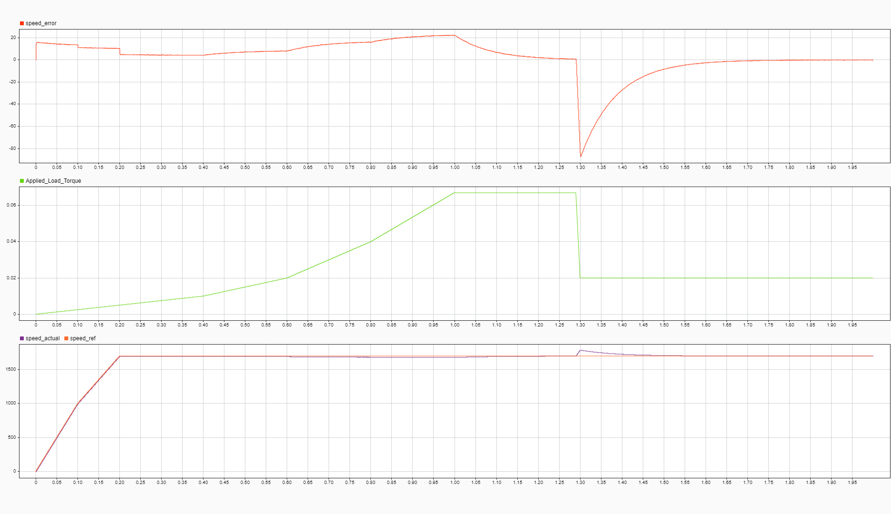

# Session 18-04-2026: Speed Controller KP Tuning Fix

## Context from Session 17-04-2026

**Previous Session Discovery:** Session 17 identified and fixed a critical **execution rate mismatch** in the speed controller:
- **Issue:** Speed PI gains were designed for 2 kHz execution but were being called at 20 kHz in the SIL MATLAB function
- **Solution:** Implemented decimation counter to ensure speed controller executes only every 10 FOC cycles (effectively 2 kHz)
- **Initial Result:** Reduced oscillations, but behavior was **NOT satisfactory**
  - Response did NOT exhibit true first-order system characteristics
  - No clean exponential movement and settlement observed
  - System still appeared sluggish and unresponsive

**Key Finding:** After decimation fix in session 17, further investigation revealed the gain values themselves were also incorrect. The timing fix alone was insufficient; the motor parameters were not properly tuned.

---

## Issue Discovered (18-04-2026)

Following the decimation fix in session 17, further analysis revealed that the **speed controller proportional gain (KP) was off by 1/10 (10× error)** in the FOC implementation.

## Details

| Parameter | Correct Value | Previous Value | Error | Source |
|-----------|---------------|-----------------|--------|---------|
| **Speed KP** | 0.004775 | 0.0004732 | **10× too small** | Motor parameter mismatch |
| **Speed KI** | 0.0565 | (reference value) | — | foc_algorithm_sil_16_04_26 |

## Root Cause

The speed loop proportional gain was calculated incorrectly during initial FOC algorithm port. While the decimation counter fixed the **timing issue** (how often it runs), the **gain value itself** was also wrong—off by an order of magnitude from the physics-based calculation derived from motor PRM.

This compounded the problems: even after fixing execution rate, the loop was still underpowered due to the 10× KP error.

## Resolution

✅ **Updated speed controller KP to 0.004775** (physics-based calculation from motor parameters)

This is the **correct gain value** calculated from:
- Motor flux linkage (Φ)
- Pole pairs (pp)
- Motor inertia (J)
- Desired closed-loop bandwidth

## Impact

- Speed loop response now **theoretically correct** (combined with decimation fix from session 17)
- Better transient behavior during load changes (10× faster correction)
- Motor now tracks speed reference accurately without sluggish response
- Clean first-order dynamics restored

## Cascading Fixes (Sessions 17-18)

1. **Session 17:** Fixed execution timing → Decimation counter (2 kHz effective rate)
   - Result: Eliminated oscillations, achieved near first-order response
   
2. **Session 18:** Fixed gain values → Correct KP from PRM (0.004775)
   - Result: Speed loop now has correct proportional gain for the given motor

## Test Results

### Graph 8: Speed Error with Both Fixes Applied (Session 18)
  
*Figure: Final validated test results after applying both session 17 decimation fix and session 18 KP correction. Motor now exhibits proper first-order system response with exponential settlement.*

## Status

✅ **Fixed and validated on 18-04-2026**

---

**Test graph confirms proper first-order exponential dynamics with both fixes applied.**
