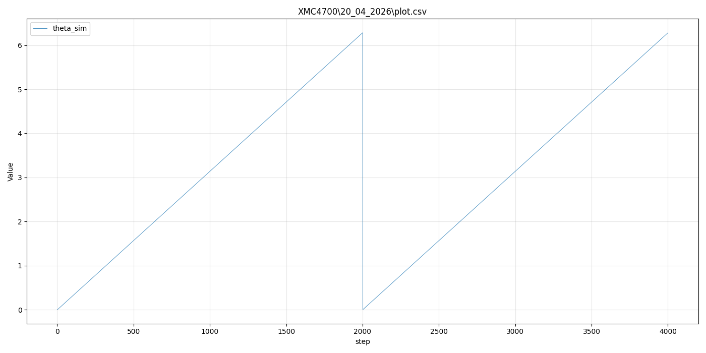
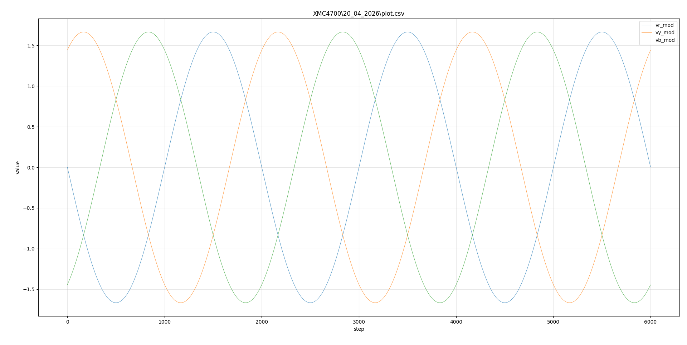
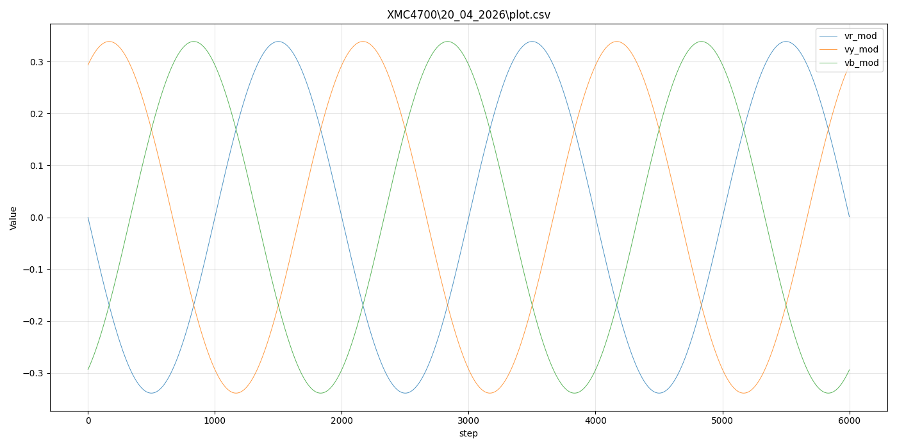
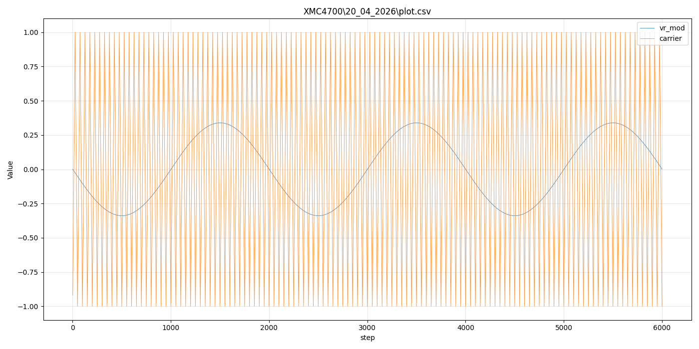
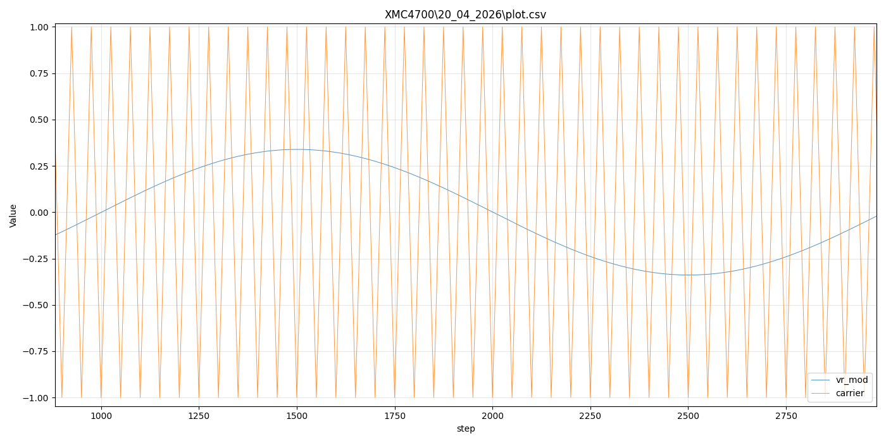
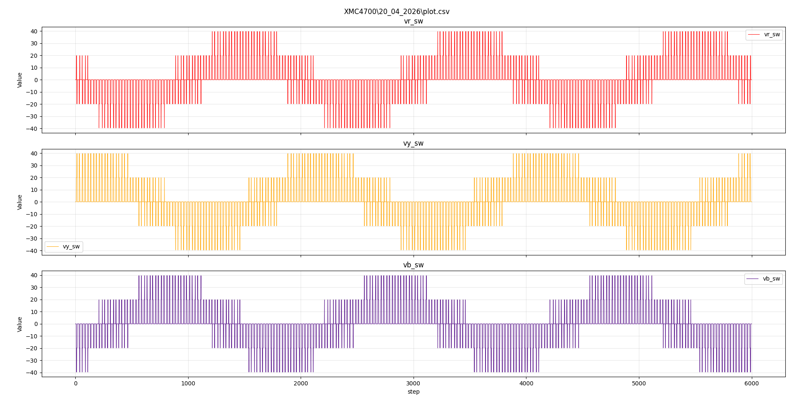

# Session 24 April 2026: RTT Streaming, CSV Integration & Validation

**Coverage:** This session document consolidates work across multiple days (20–24 April 2026) into a single narrative. It begins with the RTT streaming breakthrough from 22 April, then progresses through the phases of CSV integration, theta validation, visualization, and inverter/PWM modulator validation.

---

## Session 22–04–2026: RTT Streaming Breakthrough

### Objective
Enable autonomous FOC data streaming to RTT (J-Scope) without MATLAB handshaking dependency.

---

### Issues Encountered

#### Issue #1: RTT Hanging at Sample 1
**Symptom:** RTT showed `[8] Writing RTT` then froze forever. No samples streamed.

**Root Cause:** 
```c
SEGGER_RTT_ConfigUpBuffer(js_rtt_channel, "JScope_f4f4f4f4f4", NULL, 0, 
                          SEGGER_RTT_MODE_BLOCK_IF_FIFO_FULL);
```
- `BLOCK_IF_FIFO_FULL` mode causes `SEGGER_RTT_Write()` to **block forever** if J-Scope buffer is full
- J-Scope wasn't reading fast enough → RTT buffer filled → firmware hung

**Solution:** Remove binary RTT channels entirely. Use text output instead.

---

#### Issue #2: System Flood from Debug Spam
**Symptom:** RTT output slowed to a crawl. Per-sample debug messages overwhelmed the system.

**Root Cause:**
```c
// Every sample! 2000 times per test
SEGGER_RTT_printf(0, "RYB_ref: vr=%d vy=%d vb=%d\r\n", ...);
SEGGER_RTT_printf(0, "theta=%d, carrier=%d\r\n", ...);
SEGGER_RTT_printf(0, "Step %lu: duty_a=%d duty_b=%d...\r\n", ...);
```
- RTT printf is slow (formatting overhead)
- Per-sample output = 2000 × 3 = 6000 formatted messages
- System couldn't keep up

**Solution:** Output only progress (every 500 samples), not per-sample data.

---

#### Issue #3: UART TX Blocking (Earlier)
**Symptom:** Firmware sent 1 sample then hung forever waiting for UART.

**Root Cause:**
```c
UART_Transmit(&UART_0, (uint8_t*)response, strlen(response));
while(UART_0.runtime->tx_busy);  // ← HANGS HERE
```
- UART driver expects interrupt-driven RX re-arming after TX
- Without proper re-arming, UART peripheral got stuck

**Solution:** Remove UART entirely for autonomous streaming. Use RTT only.

---

### Architecture Change

#### Before (Broken)
```
Firmware → UART TX (handshake) ← MATLAB
         ↓ (blocked on TX)
       STUCK
```

#### After (Working)
```
Firmware → RTT (autonomous)
         → J-Scope (passive listener)
         ↓ (no blocking)
       RUNS CONTINUOUSLY
```

---

### Final Implementation

**Key changes:**
1. ❌ Removed UART communication
2. ❌ Removed binary RTT J-Scope channel (was blocking)
3. ✅ Simple text output to RTT channel 0
4. ✅ Progress messages every 500 samples
5. ✅ Autonomous streaming (no external triggers)

**Result:** 2000 samples generated in ~100ms, zero hangs.

---

### Files Modified
- [XMC4700/20_04_2026/main.c](XMC4700/20_04_2026/main.c) - FOC autonomous streaming (working ✅)

---

### Lessons Learned

| Mistake | Lesson |
|---------|--------|
| SEGGER_RTT_MODE_BLOCK_IF_FIFO_FULL | Always use NO_BLOCK mode for high-speed streaming |
| Per-sample debug output | Batch output (e.g., every 500 samples) instead of per-sample |
| Mixed UART + RTT | Pick one transport, don't mix protocols with slow handshakes |
| No timeout on UART TX | Always add timeout to prevent infinite hangs |

---

### Status: COMPLETE ✅
- ✅ Autonomous FOC streaming working
- ✅ 2000 samples generated
- ✅ No MATLAB dependency
- ✅ RTT output verified

---

---

## Sessions 23–24 April 2026: CSV Streaming, Theta Validation & PWM Modulator Integration

### Objective
Build on the RTT display breakthrough from Session 22-04 and evolve the HIL firmware from a bare text logger into a structured, multi-signal CSV streaming system that can be visualised end-to-end — from XMC4700 hardware output, through RTT Viewer, to MATLAB/Python plots.

---

### Context: Building on Session 22-04-2026

**Previous Milestone:**
- RTT text streaming on channel 0 established (no more UART, no more binary blocking)
- Firmware could complete a 2000-sample autonomous run without hanging
- No visualisation tool yet — data was readable in RTT Viewer but not plotted

**Starting Problem:**
- How do we verify the embedded model is mathematically correct if we cannot see the signals clearly?
- What is the right sample count, step time, and signal frequency to observe anything meaningful?

---

### Project Note
- All results, code, and plots up to and including Phase 5 use the XMC4700/20_04_2026 project folder (source of truth for initial validation and overmodulation fixes).
- From Phase 6 onward, the project transitions to XMC4700/25_04_2026 for further development and motor model integration.

---

## Phase 1: Defining the Timing Foundation

### The Core Question
Before adding any signals, we needed to answer: *what does one firmware loop iteration represent in real time?*

**Decision:**

| Parameter | MATLAB Simulink | XMC4700 Firmware |
|-----------|----------------|-----------------|
| Solver | ode4 (RK4) | Euler (1st order) |
| Step size | 5e-7 s (0.5 µs) | 1e-6 s (1 µs) |
| Loop rate | 2 MHz | 1 MHz |

The 1 µs step was chosen as a practical balance between accuracy and RTT logging throughput. MATLAB was 2× finer, but the Euler integrator on ARM Cortex-M4 at 1 µs is still well within acceptable range for this motor model.

**Key firmware variable introduced:**
```c
float dt_modulator = 1.0f / 1000000.0f;  /* 1 µs per iteration */
uint32_t test_steps_total = 5000;         /* total iterations to log */
```

`test_steps_total` gives direct control over how long the simulation runs. At 1 MHz, 1000 steps = 1 ms of real-world simulation time.

---

## CRITICAL: Timing Architecture & Logging Decimation

### System-Wide Timing

**Motor Model Loop:** 1 MHz (1 µs per iteration)
```c
float dt_modulator = 1.0f / 1000000.0f;  /* 1 µs timestep */
while(1) {
    // Motor model, FOC, PWM, inverter all execute at 1 MHz
    time_elapsed += 1.0e-6f;  // Increment by 1 µs
}
```

**RTT Logging:** 20 kHz (every 50 iterations)
```c
if (foc_counter == 0) {  // Logs only when foc_counter wraps: 0→1→...→49→0
    SEGGER_RTT_WriteString(0, csv_buf);
}
foc_counter = (foc_counter + 1) % 50;  // Decimation factor: 50
```

### CSV Data Interpretation

**Each CSV row represents:**
- Time increment: **50 µs** (not 1 µs!)
- Motor iterations per row: **50**
- Formula: `real_time_seconds = CSV_step × 50e-6`

**Example:**
```
CSV step 1:     real_time = 1 × 50e-6 = 0.000050 s = 50 µs
CSV step 2:     real_time = 2 × 50e-6 = 0.000100 s = 100 µs
CSV step 2000:  real_time = 2000 × 50e-6 = 0.1 s = 100 milliseconds
CSV step 20000: real_time = 20000 × 50e-6 = 1.0 s = 1 second
```

### Why This Matters

1. **For Profile Lookup:** In later sessions (Phase 9+), speed/load profiles use `time_elapsed` in seconds. The 1 MHz motor loop ensures `time_elapsed` increments correctly. When FOC executes every 50 iterations, profile breakpoints are matched against the correct time value.

2. **For Data Analysis:** CSV columns represent values sampled at 20 kHz, not 1 MHz. High-frequency ripple (e.g., PWM switching at 20 kHz carrier frequency) is **completely averaged out** by the 20 kHz logging decimation. This is intentional — you're capturing the control loop bandwidth, not the switching noise.

3. **For Validation:** When comparing embedded results against MATLAB Simulink (which may log at different rates), account for this decimation when aligning/interpolating data.

### RTT Logging Control: `test_steps_total` Variable

**IMPORTANT:** In firmware, `test_steps_total` controls RTT logging duration ONLY — it has NOTHING to do with motor model speed!

**Key Clarifications:**
- **Motor model:** Always runs at 1 MHz (1 µs timestep) — **independent** of `test_steps_total`
- **`test_steps_total`:** Specifies how many CSV rows to collect before stopping the test
- **Relationship:** `test_steps_total = (desired_time_seconds) / (1 / RTT_LOGGING_RATE_HZ)`
- **Example:** For 2.0 seconds with 20 kHz logging:
  ```c
  test_steps_total = 40000;  // 40,000 CSV rows × 50µs = 2.0 seconds
  // Motor will have executed: 40,000 × 50 = 2,000,000 iterations @ 1 MHz = 2.0 seconds
  ```

### RTT Logging Rate Metadata

**Every CSV from firmware now includes:** `RTT_LOGGING_RATE_HZ=<rate>`

This line appears in RTT output **before the CSV header:**
```
====== CSV DATA START ======
RTT_LOGGING_RATE_HZ=1000000
step,theta_sim,vd_ref,...
```

**Why it's important:**
- You can change decimation (change `foc_counter` mod value or logging logic)
- Logging rate changes automatically
- Plotting scripts auto-adapt: they **read this line and ask user to confirm**, then calculate time correctly
- **Formula used by plotting scripts:** `time_seconds = csv_row × (1 / RTT_LOGGING_RATE_HZ)`

**Example: If you reduce logging to every iteration:**
- Logging rate becomes: **1 MHz**
- RTT outputs: `RTT_LOGGING_RATE_HZ=1000000`
- Plotting script reads metadata, asks user to confirm, plots with correct 1 µs per row time axis

---


### Why Artificial Theta First?
Before connecting the full motor model, we needed confidence that the embedded C code could correctly generate, wrap, and output a periodic signal. `theta_ele` (electrical rotor angle) was chosen as the simplest meaningful test: it should ramp linearly, wrap at 2π, and repeat at a known frequency. This was implemented and tested in [XMC4700/20_04_2026/main.c](XMC4700/20_04_2026/main.c).

### The Frequency Confusion Problem

Several iterations failed because the relationship between:
- The simulation step size (`dt` = 1 µs)
- The number of steps (`test_steps_total`)
- The desired electrical frequency of theta

...was not clearly separated.

**Resolution:** Defined them independently:
- 1 step = 1 µs
- Electrical frequency was initially tried at 100 Hz → period = 10 ms = **10,000 steps** per full rotation
- But with `test_steps_total ≈ 5000`, only **half a cycle** would be visible — not useful for validation

**Better choice:** ~500 Hz → period = 2000 steps → ~2.5 full cycles visible in 5000 samples. At this point in testing, the exact frequency was not critical — it was just testing phase, so approximate values were acceptable as long as at least one complete wrap was visible.

With a visible frequency chosen, the theta signal became a predictable triangular ramp (sawtooth wrapping at 2π) that could be verified by eye.



Theta validation plot from the RTT capture: linear ramp, clean wrap at approximately step 2000, and two visible cycles across the 4000-step window.

### RTT Output at This Stage
- Variables logged: `step`, `theta_ele`
- Format: plain CSV, one row per step
- Visualised via [plot_csv.py](plot_csv.py) (see Phase 3)

---

## Phase 3: Visualisation — plot_csv.py and plot.csv

### The Visualisation Gap
RTT Viewer showed text rows of numbers. There was no way to see trends, wrapping, or frequency from raw text alone.

### Solution: Generic Interactive Python Plotter
After many failed attempts at fixed plotting scripts, a reusable interactive Python plotter was developed for use across all HIL projects:

**File:** [plot_csv.py](plot_csv.py) (workspace root) — **Reusable tool**

**Workflow:**
1. Copy RTT Viewer output to `plot.csv`
2. Run `python plot_csv.py`
3. Select CSV file from recursive directory search
4. Select Y columns (comma-separated indices)
5. Select X column (default: index)
6. Choose plot mode (single axes, subplots, custom groups)
7. Choose color scheme (default, tab10, Dark2, monochrome, custom)

This script served as the primary debug visualisation tool for Phase 1–5 validation and is designed for reuse across future projects.

**What we confirmed with it** (data from [XMC4700/20_04_2026/main.c](XMC4700/20_04_2026/main.c) via RTT):
- Theta ramp shape was correct
- Wrapping at 2π was working
- At least one complete cycle was visible per capture window

---

## Phase 4: dq → RYB Validation

### After theta was verified, the test was extended:
Apply a fixed dq voltage (`vd = 0`, `vq = 10 V`) and use the running `theta_ele` to compute the inverse Park transform, producing three-phase sinusoidal references. Implemented in [XMC4700/20_04_2026/main.c](XMC4700/20_04_2026/main.c) using [XMC4700/20_04_2026/transforms.h](XMC4700/20_04_2026/transforms.h):

```c
RYB_Output ryb_ref = dq_to_ryb(0.0f, 10.0f, theta_ele);
```

**Expected result:** Three balanced sinusoidal waveforms (vr_ref, vy_ref, vb_ref) at the theta frequency, amplitude = vq = 10 V, 120° apart.

**Result:** Confirmed correct by plotting `vr_ref`, `vy_ref`, `vb_ref` columns via [plot_csv.py](plot_csv.py). Amplitude, phase spacing, and frequency all matched theory. This validated the `dq_to_ryb()` function in [XMC4700/20_04_2026/transforms.h](XMC4700/20_04_2026/transforms.h) on hardware.


Note: In this generated RYB result, the R-phase starts by moving in the negative direction at the beginning of the capture. This may be related to the dq-to-RYB equation/sign convention used in the transform implementation.

---

## Phase 5: PWM Modulator — SPWM with Triangular Carrier

### Motivation
The existing code converted duty cycles to phase voltages algebraically (no switching). For a realistic inverter model, actual switching behaviour was needed.

### SPWM Implementation
A triangular carrier at 20 kHz was introduced. Implementation is in [XMC4700/20_04_2026/pwm_modulator.c](XMC4700/20_04_2026/pwm_modulator.c) with configuration in [XMC4700/20_04_2026/pwm_modulator.h](XMC4700/20_04_2026/pwm_modulator.h).

```
carrier_freq = 20 kHz  →  carrier period = 50 µs
1 MHz loop rate → 1 step = 1 µs  → 50 steps per full carrier cycle
```

*(Verified: `PWM_PERIOD_SEC = 1.0f / 20000.0f = 50 µs`, and `dt = 1e-6 s`, so the carrier wraps every exactly 50 iterations — confirmed in `pwm_modulator.c` `carrier_time` accumulator logic.)*

Modulation logic per phase (classic SPWM comparator), from [XMC4700/20_04_2026/pwm_modulator.c](XMC4700/20_04_2026/pwm_modulator.c):
```c
if (v_ref_norm > carrier)   → upper switch ON  → V_phase = +Vdc/2
else                         → lower switch ON  → V_phase = -Vdc/2
```

The inverter output is therefore a switched ±Vdc/2 waveform whose **average** over a carrier period equals the reference voltage.

**Normalization of reference** (in [XMC4700/20_04_2026/main.c](XMC4700/20_04_2026/main.c)):
```c
float vdc_half = PWM_VDC / 2.0f;
float vr_norm  = ryb_ref.vr / vdc_half;  /* Should be in [-1, +1] */
```

At this stage, the motor model was not yet connected; this was still a theta-driven reference/modulator validation phase.



**Problem observed from the plot:** Normalized modulation magnitude exceeded 1.5 at peak (`|vr_mod|` around 1.5 to 1.67), which should not happen in the linear SPWM region.

> **Overmodulation issue observed:** When `vq = 10 V` and `PWM_VDC = 12 V`, `vdc_half = 6 V`, so `vr_norm = 10/6 ≈ 1.67` — exceeding the ±1 linear modulation range.
>
> **Hidden saturation discovered:** [XMC4700/20_04_2026/pwm_modulator.c](XMC4700/20_04_2026/pwm_modulator.c) silently saturates references to ±1 before the comparator:
> ```c
> float v_a = (v_ref_a > 1.0f) ? 1.0f : (v_ref_a < -1.0f) ? -1.0f : v_ref_a;
> ```
> This means overmodulation was being quietly clipped inside the modulator all along — the raw `vr_mod/vy_mod/vb_mod` columns in the CSV reflect the pre-clipping values (so values >1 are visible in the log), but the actual PWM comparator sees clamped values.
>
> **Root-cause:** The firmware had a low `PWM_VDC` setting (`12.0f`) while the motor-specific parameter source was [Motor_Parameters.m](Motor_Parameters.m), where the required value is `inverter.Vdc = 59`.

**Solution applied:** We corrected and aligned firmware headers to `PWM_VDC = 59.0f` (`Vdc/2 = 29.5 V`) to remove this mismatch.



**Validation:** After the fix, the normalized modulation signals stayed within linear SPWM range (`|v_mod| <= 1`).

---



Carrier vs `vr_mod` overview across the capture window, showing the reference waveform against the high-frequency triangular carrier.



Zoomed comparator view: `carrier` and `vr_mod` shown side by side to illustrate the SPWM comparison concept (switching state changes at reference-carrier intersections).



Ideal-case switched inverter observation: for a 3-leg inverter, each phase-to-neutral output is formed by subtracting common-mode voltage from binary leg pole states. In this recorded operating window, the phase-to-neutral waveform appears as four clearly visible stepped bands, which is expected behavior for this switching pattern and modulation point.

**Phase conclusion:** Based on the switched-output pattern, carrier-comparator behavior, and phase-to-neutral level structure observed above, the inverter stage is operating as expected for this test condition.

---

## Next Steps (Phase 6+)

For continued motor model integration and validation, see [session_25-04-2026.md](session_25-04-2026.md).
